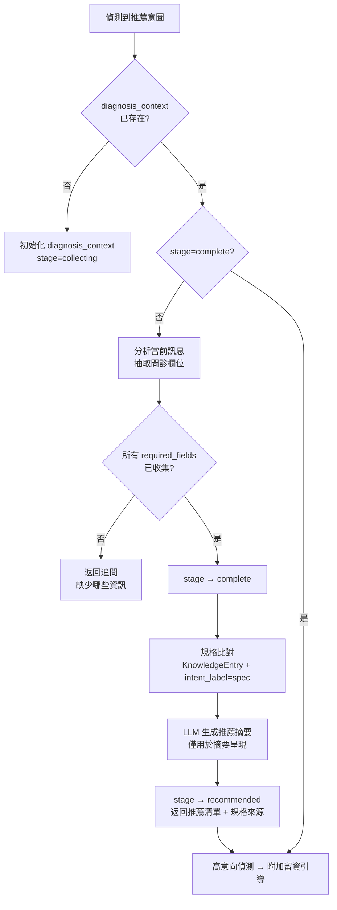
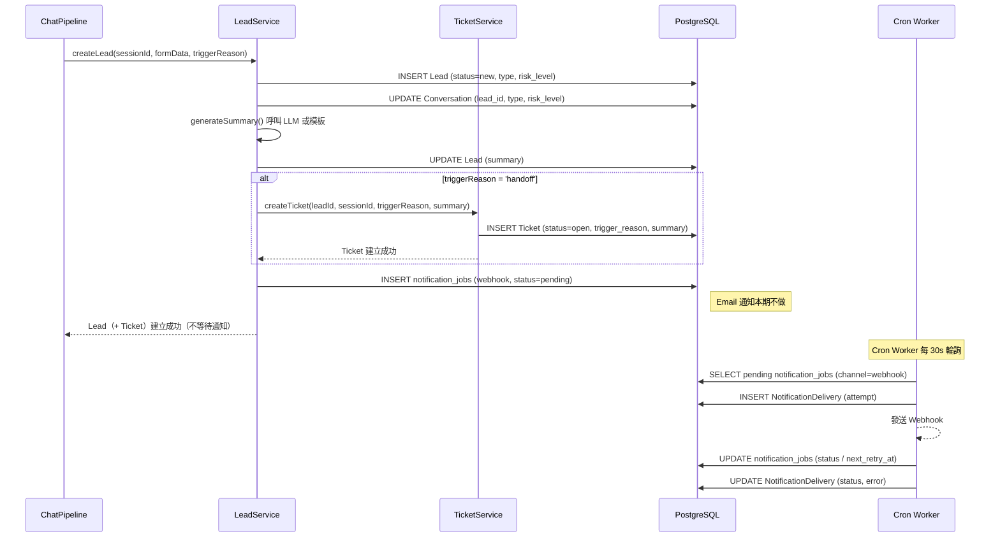

# 震南官網 AI 客服聊天機器人 — Backend Design

**版本**：1.9.0 | **建立日期**：2026-04-09 | **狀態**：Draft  
**承接文件**：`spec.md` v1.7.0  
**下游文件**：`plan.md`、`task.md`

---

## 1. 文件目的

本文件為「震南官網 AI 客服聊天機器人後端系統」的技術設計文件（Design Doc），定義：

- 系統的分層架構與模組切分方式
- 核心處理流程（Pipeline）的設計
- 資料模型的主要 Entity 與關聯
- 外部整合的抽象設計
- 錯誤處理、降級、稽核、可觀測性的設計
- 本期技術選擇及其理由

本文件**承接** `spec.md` 的功能需求與非功能需求，**不重複**需求描述。  
本文件**不定義** task 拆分、工時估算、進度計劃，那些屬於 `plan.md` / `task.md` 的範疇。

> **本期實作總原則**：本期後端聊天主流程採 SSE / streaming 串接外部 LLM provider；本期預設 provider 為 OpenAI（`OpenAiProvider`），provider 需可替換（未來可擴充 `ClaudeProvider`）；前端以 `sessionToken` 作為匿名訪客會話識別，後端內部映射至 `sessionId`。本期正式提供 Widget Config API。本期正式納入 Dashboard、Feedback、Ticket。本期不做 Auth / Login / RBAC、Email 通知、handoff status API。

---

## 2. 設計目標（Design Goals）

| # | 目標 |
|---|------|
| DG-1 | 所有業務規則集中管理，不散落在 Controller / Interceptor 中 |
| DG-2 | 外部 LLM Provider（本期預設 OpenAI）可替換，業務邏輯不依賴特定 SDK，僅依賴 `ILlmProvider` 抽象；LLM 是核心回覆生成器，但不是自由回答器 |
| DG-3 | 知識檢索策略可替換，本期主方案為 `pg_trgm + metadata filter + intent/glossary boost`；FTS 為可選優化，不是主依賴 |
| DG-4 | Prompt Guard / 機密判斷必須先於任何 LLM 呼叫完成；RAG 信心分數必須達閾值才可呼叫 LLM |
| DG-5 | 所有高風險決策與外部呼叫必須可追溯（Audit Log），包含 LLM 呼叫成本、token 用量與回覆時間 |
| DG-6 | 系統可降級運作；AI 失效時留資與聯絡功能不受影響 |
| DG-7 | 適合單人開發：MVP 優先，分層清晰，可漸進擴充 |
| DG-8 | 設定值（閾值、速率限制等）集中管理，不硬編碼 |

---

## 3. 非目標（Non-Goals）

本文件明確**不設計**下列項目：

- 前端 UI、畫面元件、樣式、RWD
- Auth / Login / RBAC（本期不實作；後台 API 採基礎設施層保護）
- 多租戶架構
- 向量資料庫（pgvector / Pinecone 等）— 本期不引入，架構保留擴充點
- 自動封鎖敏感用戶（本期僅記錄，不封鎖）
- Dashboard 前端 / 視覺化報表前端（後端 API 做，前端介面不在本文件範疇）
- handoff status 查詢 API（本期 handoff = 建立 Lead + Ticket + 回傳 action=handoff）
- Email 通知（`IEmailProvider` 介面保留，本期不實作）

---

## 4. 與 spec.md 的對應範圍

| spec.md 章節 | 本文件對應章節 |
|---|---|
| FR-001 ~ FR-008 聊天主流程 | §8 請求處理主流程設計 |
| FR-010 ~ FR-017 知識檢索與回覆生成 | §14 檢索與回覆生成設計 |
| FR-020 ~ FR-025 問診式推薦 | §9 問診式推薦流程設計 |
| FR-030 ~ FR-034 意圖識別 | §8.4 / §14.2 |
| FR-040 ~ FR-044 多語系 | §8.3 語言偵測 |
| FR-050 ~ FR-056 機密保護 | §10 機密保護與 Prompt Guard 設計 |
| FR-060 ~ FR-068 留資與轉人工 | §11 留資 / 轉人工 / 通知流程設計 |
| FR-070 ~ FR-077 知識庫管理 | §7 模組責任 / §13 資料模型設計 |
| NFR-001 ~ NFR-008 安全 | §10 / §17 設定管理 / §19 部署前提 |
| NFR-010 ~ NFR-014 AI 品質 | §14 檢索與回覆生成設計 |
| NFR-020 ~ NFR-027 效能 | §12 降級與錯誤處理 / §19 部署前提 |
| NFR-030 ~ NFR-033 可靠性 | §12 降級與錯誤處理設計 |
| NFR-040 ~ NFR-043 可維護性 | §6 核心設計決策 |

---

## 5. 系統架構總覽

### 5.1 整體架構圖

```
┌─────────────────────────────────────────────────────────┐
│                    NestJS Backend                        │
│                                                          │
│  ┌──────────┐   ┌──────────────────────────────────┐    │
│  │  Public  │   │         Admin API                 │    │
│  │  Chat    │   │  (受控環境 / VPN / 白名單保護)     │    │
│  │  API     │   │  knowledge / audit / lead query   │    │
│  └────┬─────┘   └─────────────────┬────────────────┘    │
│       │                           │                      │
│  ┌────▼───────────────────────────▼──────────────────┐  │
│  │               Application Layer                    │  │
│  │  ChatPipeline / LeadService / KnowledgeService     │  │
│  └────┬────────────────────────────────┬──────────────┘  │
│       │                                │                  │
│  ┌────▼───────────┐        ┌───────────▼──────────────┐  │
│  │  Domain/Rule   │        │     Repository Layer      │  │
│  │  Layer         │        │  Prisma-based Repos       │  │
│  │  (Guard/Intent/│        │  Conversation / Knowledge │  │
│  │   RAG Rules)   │        │  Lead / AuditLog          │  │
│  └────────────────┘        └───────────────────────────┘  │
│                                                           │
│  ┌────────────────────────────────────────────────────┐  │
│  │              External Integration Layer             │  │
│  │   ILlmProvider          │  EmailProvider           │  │
│   (default: OpenAiProvider│   reserved / future     │  │
│  │   WebhookClient         │  （reserved / future,    │  │
│  │   LanguageDetector      │   本期不啟用）            │  │
│  └────────────────────────────────────────────────────┘  │
└─────────────────────────────────────────────────────────┘
        │                    │                  │
   ┌────▼─────┐    ┌─────────▼──────┐  ┌───────▼─────────────┐
   │ Postgres │    │  LLM Provider  │  │  External Webhook    │
   │ (主資料) │    │  API (OpenAI)  │  │  (active 本期啟用)   │
   └──────────┘    └────────────────┘  │  SMTP (future,       │
                                       │   本期不啟用)         │
                                       └─────────────────────┘
```

### 5.2 分層定義

| 層級 | 責任 | 禁止事項 |
|------|------|---------|
| **Controller / API Layer** | 接收 HTTP 請求、輸入驗證（DTO）、路由分派、回傳標準格式 | 不可包含業務規則；不可直接呼叫外部服務 |
| **Application Layer** | 編排業務流程（use case）；呼叫 Domain Rules、Repositories、External Integrations | 不可直接使用 Prisma Client；不可包含 HTTP 細節 |
| **Domain / Rule Layer** | 機密判斷、Prompt Guard、意圖路由、信心分數判斷、留資觸發條件 | 不可依賴 HTTP context；不可有 DB 操作 |
| **Repository Layer** | 所有 DB 操作（Prisma）；提供 domain model 給上層 | 不可包含業務邏輯；不可呼叫外部服務 |
| **External Integration Layer** | LLM Provider、Email、Webhook、語言偵測 | 不可混入業務規則；介面需可替換 |
| **Shared / Common** | DTO、Exception Filter、Interceptors、Logger、Config、Utils | — |

---

## 6. 核心設計決策（Key Design Decisions）

### KDD-1：單一 NestJS 應用，不做微服務

**選擇**：本期採單體 NestJS 應用，模組化切分。  
**理由**：單人開發、MVP 階段；微服務帶來的網路複雜度、部署複雜度與偵錯成本在此階段弊大於利。模組邊界清晰即可漸進拆分。

### KDD-2：檢索策略：pg_trgm + metadata filter + intent/glossary boost

**選擇**：本期以 `pg_trgm` trigram 相似度為核心，搭配 `intent_label` / `tags` metadata filter 及 GlossaryTerm 詞彙 boost，作為主要 RAG 檢索方案；不引入獨立向量資料庫。FTS（`tsvector` / `ts_rank`）為可選優化，不是本期主依賴。  
**理由**：
- `pg_trgm` 直接對中文、英文字元 trigram 計算相似度，**不依賴斷詞工具**，在 managed DB 環境零額外安裝負擔
- 可透過知識條目的 `intent_label` / `tags` 做 metadata filter，彌補純文字匹配的語意不足；GlossaryTerm 提供領域詞彙 boost
- 架構上以 `IRetrievalService` 介面隔離，未來升級至 pgvector 或混合檢索無需改動 Application Layer
- 若部署環境不支援 `pg_trgm`，允許退回 ILIKE 簡化 fallback（詳見 §14.1），不阻擋 MVP 開發

### KDD-3：LLM Provider 抽象化，本期預設 OpenAiProvider 實作

**選擇**：定義 `ILlmProvider` 介面，本期預設以 `OpenAiProvider` 實作（OpenAI Chat Completions API）；透過 NestJS DI 注入；未來可新增 `ClaudeProvider` 等實作，不影響 Pipeline 及業務邏輯。  
**理由**：業務邏輯只依賴 `ILlmProvider` 介面，不得直接呼叫任何特定 provider SDK。**LLM 是主回覆生成器，但不是自由回答器**：只在 RAG 信心分數達閾值後才可呼叫，prompt 由 `PromptBuilder` 嚴格控制 context 範圍。LLM 回應需記錄 token 用量、回覆時間與 model 資訊，供成本追蹤與異常分析使用。

**本期模型策略**：
- 主力 / demo：`gpt-5.4-mini`
- 高品質測試：`gpt-5.4`
- 廉價快速 / fallback：`gpt-5.4-nano`
- 模型透過 `LLM_MODEL` 環境變數切換，不可硬寫死在業務邏輯中

**本期 LLM Fallback 策略**：
- 第一層：主模型（`gpt-5.4-mini`）失敗 → 改用較便宜較快模型（`gpt-5.4-nano`）
- 第二層：次級模型仍失敗 → 顯示固定 fallback 訊息：「目前 AI 忙碌中，請留下聯絡資訊 / 聯絡業務」
- fallback 為正式產品流程，非臨時補丁；fallback 觸發時必須寫入 AuditLog（`fallbackTriggered=true`）

### KDD-4：Prompt Guard 與 RAG 信心分數為強制同步前置步驟

**選擇**：Prompt Guard / 機密判斷在 Pipeline 中作為同步阻斷步驟，任何 LLM 呼叫之前必須通過；RAG 信心分數為硬性短路門檻，低於閾值不得觸發 LLM 生成。  
**理由**：防止任何安全漏洞繞過；不可依賴 system prompt 文字進行安全防護；低信心時呼叫 LLM 等同允許幻覺生成，違反 Strong RAG 原則。

### KDD-5：通知採 DB Outbox 模式 + Cron Worker 重試（不引入 Redis）

**選擇**：本期為降低基礎設施與維運複雜度，**不引入 Redis / Bull Queue**。通知採 **DB Outbox 模式**：Lead 建立時同步寫入 `notification_jobs` 待發記錄，由背景 Cron Worker（`@nestjs/schedule`）輪詢發送與重試，`NotificationDelivery` 記錄每次嘗試結果。Lead 建立本身為同步操作，通知為非同步背景處理。本期 Outbox 僅用於 Webhook 推送；Email 通知本期不做，`channel='email'` 欄位為未來擴充保留。  
**理由**：
- 單人 MVP，零外部依賴（只需 Postgres）更易部署與維運
- DB Outbox 模式可靠，重試邏輯自行掌控，不依賴 Redis 可用性
- `@nestjs/schedule` 為 NestJS 內建，不需額外套件
- 架構保留未來升級至 Bull Queue / Redis 的擴充點（`INotificationQueue` 介面隔離）

**通知採資料表 outbox 模式，保留未來升級至 queue-based 架構的擴充點。**  
Bull Queue + Redis 列為未來擴充，不納入本期主設計。

### KDD-6：稽核日誌為 append-only，獨立於業務資料

**選擇**：`AuditLog` 不允許 UPDATE / DELETE；以 INSERT only 策略運作；保存期限由環境設定決定。

### KDD-7：問診狀態存於 Conversation context

**選擇**：問診狀態（已收集欄位、問診階段）存於 `Conversation.diagnosis_context`（JSONB）；不另建獨立 state machine service。  
**理由**：MVP 階段問診邏輯相對固定，JSONB 欄位足夠表達且易查詢；未來可升級為獨立 state machine。

### KDD-8：Ticket 為本期正式資料實體，與 Lead 清楚分工

**選擇**：本期建立 `Ticket` 資料模型，代表人工接手案件；`Lead` 代表潛在客戶 / 留資紀錄。兩者有清楚分工：
- `Lead`：訪客留資意願的記錄，含聯絡資訊與需求摘要
- `Ticket`：轉介 / 人工接手後的案件追蹤，含狀態流轉、處理紀錄、處理備註

handoff 觸發時，後端建立 Lead 與 Ticket，回傳 `action=handoff`；前端顯示「已轉交專人協助」。  
**不提供 handoff status 輪詢 API**（見 KDD-9）；Ticket 狀態管理透過後台管理介面處理。

### KDD-9：聊天主流程採 SSE / Streaming 回覆

**選擇**：本期後端聊天回覆通道採 **Server-Sent Events（SSE）**。每個 token chunk 以 `data: {"token":"..."}` 格式推送；完成時發送 `event: done`；異常時發送 `event: error` / `event: timeout` / `event: interrupted`。前端連線中斷時後端感知並中止 LLM streaming 呼叫（避免浪費 token）。

`ILlmProvider` 介面包含 `stream()` 方法，本期由 `OpenAiProvider` 實作（OpenAI streaming API，`stream: true`）；未來可由 `ClaudeProvider` 等實作替換。

**handoff status 查詢 API 不在本期範疇**：handoff 語意為「建立 Lead + Ticket + 回傳 action=handoff」，不提供後續輪詢介面；此設計明確排除本期。

### KDD-10：sessionToken 為前端匿名會話識別，sessionId 為後端內部主鍵

**選擇**：`Conversation` 表新增 `session_token` 欄位（UUID，unique，indexed，NOT NULL）；建立會話時生成並返回給前端；前端所有 chat / lead / history 請求帶此 token；後端以 `session_token` 查找 `Conversation.id`（即 sessionId）進行關聯。

後端對外 API 一律使用 `sessionToken`；DB PK（`Conversation.id`）即 sessionId，僅在後端內部使用。  
所有內部資料表（ConversationMessage、Lead、Ticket、AuditLog）仍以 `session_id`（DB PK UUID）作為關聯鍵。

---

## 7. 模組切分與責任邊界

### 7.1 本期必做模組

| 模組 | 說明 | 本期狀態 |
|------|------|---------|
| `ChatModule` | 建立 session（回傳 sessionToken）、SSE 串流訊息發送、取得對話歷史、Pipeline 編排入口 | ✅ 本期 |
| `ConversationModule` | Conversation / ConversationMessage 的持久化與查詢；sessionToken → sessionId 映射 | ✅ 本期 |
| `KnowledgeModule` | 知識條目 CRUD、版本管理、審核狀態管理 | ✅ 本期 |
| `RetrievalModule` | 知識檢索（`pg_trgm + metadata filter + intent/glossary boost`）、信心分數計算；FTS 為可選優化 | ✅ 本期 |
| `SafetyModule` | Prompt Guard、Blacklist 管理、機密判斷、敏感意圖累積記錄 | ✅ 本期 |
| `IntentModule` | 意圖識別、意圖模板管理、GlossaryTerm 管理 | ✅ 本期 |
| `LeadModule` | 留資收集、Lead CRUD、觸發條件判斷 | ✅ 本期 |
| `TicketModule` | 人工接手案件追蹤、Ticket CRUD、狀態流轉、處理備註 | ✅ 本期 |
| `FeedbackModule` | 訪客回饋（評分 + 原因）收集、Feedback CRUD、後台查詢 | ✅ 本期 |
| `DashboardModule` | 營運指標聚合 API（對話量、Lead 數、Feedback 分數、fallback 率等）| ✅ 本期 |
| `WidgetConfigModule` | Widget 前端初始化設定 API（從 SystemConfig 讀取，供前端 Widget 初始化） | ✅ 本期 |
| `NotificationModule` | Webhook 發送、NotificationDelivery 記錄、重試（本期）；Email 通知本期不做，架構保留 `IEmailProvider` 介面擴充點 | ✅ 本期（Webhook）|
| `AuditModule` | AuditLog 寫入與查詢 | ✅ 本期 |
| `LlmModule` | LLM Provider 抽象（`ILlmProvider`）+ `OpenAiProvider` 預設實作（含 streaming）、Prompt Builder；未來可擴充 `ClaudeProvider` | ✅ 本期 |
| `HealthModule` | `/health` endpoint、降級狀態查詢 | ✅ 本期 |
| `ConfigModule` | 環境設定、SystemConfig / ThresholdConfig 管理 | ✅ 本期 |

### 7.2 可先簡化的模組

| 模組 | 簡化策略 |
|------|---------|
| `IntentModule` | MVP 以 keyword + 意圖模板 rule-based 為主，不做 ML 意圖分類 |
| `NotificationModule` | 本期主體為 Webhook 推送；Email 通知本期不做，保留 `IEmailProvider` 介面為後續擴充點 |
| `HealthModule` | 初期只做 `/health` 基本存活檢查，降級狀態可後補 |

### 7.3 未來擴充模組

| 模組 | 說明 |
|------|------|
| `AuthModule` | RBAC / 登入驗證（明確排除本期） |

### 7.4 模組依賴方向

```
ChatModule
  ├── ConversationModule
  ├── SafetyModule
  ├── IntentModule
  ├── RetrievalModule
  ├── LlmModule
  ├── LeadModule
  │     ├── TicketModule
  │     └── NotificationModule
  ├── FeedbackModule
  └── AuditModule

KnowledgeModule
  └── RetrievalModule (uses KnowledgeRepo)

DashboardModule
  ├── ConversationModule (read)
  ├── LeadModule (read)
  └── FeedbackModule (read)

WidgetConfigModule
  └── ConfigModule (reads SystemConfig)

ConfigModule (global)
PrismaModule (global)
```

> ⚠️ 禁止循環依賴；`AuditModule` 只被其他模組呼叫，不依賴業務模組。

---

## 8. 請求處理主流程設計（聊天 Pipeline）

### 8.1 Pipeline 總覽

```mermaid
flowchart TD
    A[POST /api/v1/chat/sessions/:sessionToken/messages\n→ 回傳 SSE stream] --> B[InputValidation\n長度/格式/whitelist]
    B --> C{長度超限?}
    C -- 是 --> ERR1[400 Bad Request]
    C -- 否 --> D[LanguageDetection\n偵測語言 zh-TW / en]
    D --> E[PromptGuard\nblacklist / injection pattern 掃描]
    E --> F{Guard 攔截?}
    F -- 是 --> G[SSE event: done\n拒答回覆\n寫入 AuditLog\nguard_blocked=true]
    F -- 否 --> H[ConfidentialityCheck\n意圖 + 知識分級判斷]
    H --> I{機密觸發?}
    I -- 是 --> J[SSE event: done\n拒答回覆\n引導留資\n寫入 AuditLog\nconfidential_triggered=true]
    I -- 否 --> K[IntentRecognition\n判斷意圖 + 信心分數]
    K --> L{意圖=詢價/轉人工?}
    L -- 是 --> LEAD[直接觸發留資流程]
    L -- 否 --> M{意圖=推薦?}
    M -- 是 --> DIAG[進入問診流程]
    M -- 否 --> N[KnowledgeRetrieval\npg_trgm + metadata filter\n+ intent/glossary boost\n只取 public + approved]
    N --> O{RAG 信心分數\n>= 閾值?}
    O -- 否 (無命中) --> P[SSE event: done\n返回無法確認\n引導留資]
    O -- 否 (低信心) --> Q[SSE event: done\n返回追問\n請補充資訊]
    O -- 是 --> R[組裝 Prompt Context\nRAG 結果 + 對話歷史]
    R --> S[LLM Streaming 生成\nILlmProvider.stream()\n本期: OpenAiProvider stream=true]
    S --> T{LLM 呼叫成功?}
    T -- 否 --> U[SSE event: error / timeout\nFallback 回覆\n記錄降級事件]
    T -- 是 --> V[SSE data: token chunks...\n→ event: done 含完整 metadata]
    V --> W{高意向偵測?}
    W -- 是 --> X[done event 附加留資引導]
    W -- 否 --> Y[完成 SSE 串流]
    X --> Y
    Y --> Z[寫入 ConversationMessage\n+ AuditLog]
```

### 8.2 各步驟說明

#### 步驟 1：InputValidation
- 使用 NestJS `ValidationPipe` 搭配 DTO
- 訊息長度上限由 `SystemConfig.max_message_length` 決定（預設 2000 字元）
- `whitelist: true` 拒絕未定義欄位

#### 步驟 2：LanguageDetection
- 呼叫 `LanguageDetector`（輕量 rule-based 或 `franc` 套件）
- 支援 `zh-TW`、`en`；無法辨識則預設 `zh-TW`
- 結果存入本次 pipeline context，寫入 ConversationMessage

#### 步驟 3：PromptGuard
- 由 `SafetyService.scanPrompt()` 執行
- 規則包含：
  - **Blacklist** 關鍵字比對（來自 DB `BlacklistEntry`，可動態更新）
  - **Pattern** 正規表示式比對（試圖覆寫 system prompt、要求揭露 prompt、越獄指令）
  - **Hash 比對**：計算輸入 SHA256，比對已知攻擊 hash
- 攔截時：返回標準拒答 + 記錄攔截分類、輸入 hash 至 AuditLog
- **不呼叫任何 LLM**

#### 步驟 4：ConfidentialityCheck
- 檢查訊息是否觸及 `confidential` 或 `internal` 分級知識的意圖
- 使用意圖模板 + confidential keyword list 比對
- 觸發時：拒答 + 引導留資 + 寫入 AuditLog（`confidentiality_triggered=true`）
- 累積計數存入 `Conversation.sensitive_intent_count`

#### 步驟 5：IntentRecognition
- `IntentService.detect()` 執行
- MVP 策略：keyword matching + 意圖模板（`IntentTemplate` 表）+ 詞彙表（`GlossaryTerm`）
- 返回：`intent_label`、`intent_confidence`
- 高優先意圖直接路由（詢價 → Lead；推薦 → Diagnosis）

#### 步驟 6：KnowledgeRetrieval
- 僅查詢 `status=approved AND visibility=public`
- **主方案**：`pg_trgm` trigram 相似度 + metadata filter（`intent_labels`、`tags`）+ GlossaryTerm 詞彙 boost，返回 Top-K 結果（K = `SystemConfig.retrieval_top_k`，預設 5）
- **Fallback**（pg_trgm 不可用時）：ILIKE 關鍵字比對 + metadata filter（詳見 §14.1）
- FTS（`tsvector` / `ts_rank`）可作為可選追加得分項，不作為必要路徑
- 每個結果附帶 `rag_score`（0–1 正規化）

#### 步驟 7：信心分數判斷
- 取 Top-1 的 `rag_score` 與 `SystemConfig.rag_confidence_threshold` 比較
- `score >= threshold`：允許 LLM 生成
- `score < threshold AND score >= SystemConfig.rag_minimum_score`：返回追問
- `score < rag_minimum_score` 或無結果：返回無法確認 + 留資引導

#### 步驟 8：Prompt 組裝與 LLM Streaming 生成
- `PromptBuilder.build()` 組裝：system prompt + RAG context + 對話歷史（最近 N 輪）
- 呼叫 `ILlmProvider.stream()`（本期由 `OpenAiProvider` 實作 OpenAI streaming API，`stream: true`）
- token chunk 逐步推送至 SSE stream（`event: token\ndata: {"token":"..."}`）
- 完成後：`event: done` 附帶完整 metadata（`messageId`、`action`、`sourceReferences`、`usage`）
- LLM 呼叫結果（model、provider、promptTokens、completionTokens、totalTokens、durationMs）**全部寫入 AuditLog**，支援成本追蹤、回覆品質問題追蹤、異常請求分析與模型切換比較

#### 步驟 9：高意向偵測
- `IntentService.isHighIntent()` 判斷：
  - 近 N 輪對話中出現詢價關鍵字
  - 推薦問診完成
  - `Conversation.high_intent_score >= SystemConfig.high_intent_threshold`
- 觸發時：回覆附加留資引導文字

#### 步驟 10：寫入與回傳
- 收集完整 SSE 串流後（或在 done event 時），寫入 `ConversationMessage`（含所有欄位）
- 寫入 `AuditLog`（含 config snapshot）
- SSE `event: done` 即代表回應完成

### 8.3 Response DTO 結構

聊天 API 採 SSE 串流，回應格式為 `text/event-stream`：

```
// token chunk（多個）
event: token
data: {"token":"..."}

// 完成事件（包含完整 metadata）
event: done
data: {
  "messageId": "uuid",
  "action": "answer" | "handoff" | "fallback" | "intercepted",
  "sourceReferences": [{ "id": "uuid", "version": 1 }],
  "usage": {
    "promptTokens": 0,
    "completionTokens": 0,
    "totalTokens": 0,
    "durationMs": 0,
    "model": "string",
    "provider": "string"
  }
}

// 後端錯誤
event: error
data: {"code":"string","message":"string"}

// LLM 超時
event: timeout
data: {"message":"string"}

// 後端感知前端斷線，中止串流
event: interrupted
data: {"message":"string"}
```

> 非串流回覆路徑（如 Prompt Guard 攔截、機密拒答、低信心直接回覆）：仍以 SSE 格式推送，直接發送 `event: done`（不推送 token chunk）。

### 8.4 SSE 串流傳輸設計

- **端點**：`POST /api/v1/chat/sessions/:sessionToken/messages`  
  `Content-Type: text/event-stream`（回應），`Accept: text/event-stream`（請求 header）
- **事件格式**：
  - `event: token\ndata: {"token":"..."}` — LLM token chunk（零個或多個）
  - `event: done\ndata: {...}` — 串流完成，含完整 metadata（`messageId`、`action`、`sourceReferences`、`usage`）
  - `event: error\ndata: {"code":"string","message":"string"}` — 後端錯誤
  - `event: timeout\ndata: {"message":"string"}` — LLM 超時
  - `event: interrupted\ndata: {"message":"string"}` — 後端感知前端斷線，中止串流
- **前端實作**：正式採 **fetch + ReadableStream** 接收 SSE；不使用 `EventSource`（`EventSource` 不支援 POST 請求與自訂 header）
- **取消串流**：以 **request abort / connection close** 為正式機制（前端呼叫 `AbortController.abort()`）；**不設計獨立 cancel endpoint**
- **前端斷線偵測**：NestJS SSE 可透過 `res.on('close', callback)` 感知；觸發後呼叫 `AbortController.abort()` 中止 LLM streaming 呼叫（避免浪費 token）
- **Fallback 路徑**：AI 失效時不推送 token chunk，直接推送一次 `event: done` 含 fallback 回覆內容
- **NestJS 實作**：使用 `@nestjs/platform-express` SSE；Controller method 回傳 `Observable<MessageEvent>` 或直接操作 `res.write()` / `res.end()`

### 8.5 sessionToken → sessionId 映射設計

- `Conversation.session_token`：UUID v4，建立會話時生成，NOT NULL，unique，indexed
- 建立會話 API（`POST /api/v1/chat/sessions`）回傳 `sessionToken`（**不回傳 sessionId**）
- 所有前端請求帶 `sessionToken`：後端以 `ConversationRepository.findBySessionToken(token)` 查找 `Conversation`
- 若 sessionToken 不存在，回傳 404
- 內部所有關聯（ConversationMessage、Lead、Ticket、AuditLog）仍使用 `Conversation.id`（DB PK UUID）作為 `session_id` 外鍵

### 8.6 Widget Config API 設計

- **端點**：`GET /api/v1/widget/config`（公開端點，不需 /admin/ 保護，供前端 Widget 初始化使用）
- **資料來源**：`SystemConfig` 表（keys：`widget_status`、`widget_welcome_message`（JSONB）、`widget_quick_replies`（JSONB）、`widget_disclaimer`（JSONB）、`widget_fallback_message`（JSONB））
- **回傳格式**：
  ```json
  {
    "status": "online" | "offline" | "degraded",
    "welcomeMessage": { "zh-TW": "string", "en": "string" },
    "quickReplies": { "zh-TW": ["string"], "en": ["string"] },
    "disclaimer": { "zh-TW": "string", "en": "string" },
    "fallbackMessage": { "zh-TW": "string", "en": "string" }
  }
  ```
- **AI 失效時**：`AiStatusService.degraded=true` 時，`status` 自動回傳 `"degraded"`（不再回傳 `"busy"`）
- **快取策略**：Widget Config 資料變動不頻繁，可採 `ConfigService` in-memory 快取（與 SystemConfig 同批更新）

### 8.7 對話歷史查詢 API

- **端點**：`GET /api/v1/chat/sessions/:sessionToken/history`
- **功能**：依 `sessionToken` 查詢對應會話的所有 `ConversationMessage` 紀錄，依 `turn_id` 升序排列
- **權限**：前端公開端點（帶 `sessionToken` 即可，無需 admin 身份）
- **回傳格式**：
  ```json
  {
    "sessionToken": "uuid",
    "messages": [
      {
        "id": "uuid",
        "turnId": 1,
        "role": "user" | "assistant",
        "message": "string",
        "action": "answer" | "handoff" | "fallback" | "intercepted" | null,
        "sourceReferences": [{ "id": "uuid", "version": 1 }],
        "createdAt": "ISO 8601"
      }
    ]
  }
  ```
- **例外**：`sessionToken` 不存在時回傳 404

### 8.8 Handoff API

- **端點**：`POST /api/v1/chat/sessions/:sessionToken/handoff`
- **功能**：由前端明確觸發轉人工；後端建立 Lead（`trigger_reason=handoff`）+ Ticket，回傳 handoff 語意結果
- **語意說明**：
  - `/handoff` 為**訪客主動觸發轉人工**的獨立端點，由前端呼叫（例如：點擊「聯絡客服」按鈕）
  - `/lead` 為**訪客填寫留資表單**的端點（主動留下聯絡資訊）
  - 兩者語意不同，不可混用
- **Request Body**：無必填欄位（或可傳入 `note?: string` 作為轉人工備註）
- **Response**：
  ```json
  {
    "accepted": true,
    "action": "handoff",
    "leadId": "uuid | null",
    "ticketId": "uuid | null",
    "message": "已轉交專人協助"
  }
  ```
  > `leadId` / `ticketId` 為 nullable — 若後端建立 Lead 或 Ticket 失敗（非阻斷性錯誤），可為 `null`；前端應以 `accepted: true` 為主要判斷依據。
- **例外**：`sessionToken` 不存在時回傳 404；同一會話已存在 handoff ticket 時回傳 409

---

## 9. 問診式推薦流程設計

### 9.1 問診狀態管理

問診狀態存於 `Conversation.diagnosis_context`（PostgreSQL JSONB 欄位）。

**本期問診欄位固定為四項，追問順序固定：**
1. `purpose`（用途）
2. `material`（材質）
3. `thickness`（厚度）
4. `environment`（使用環境）

```json
{
  "stage": "collecting" | "complete" | "recommended",
  "collected": {
    "purpose": null,
    "material": null,
    "thickness": null,
    "environment": null
  },
  "required_fields": ["purpose", "material", "thickness", "environment"],
  "turn_count": 2
}
```

> `required_fields` 順序即追問順序，系統依序追問尚未收集的欄位。欄位清單固定，不可由 LLM 自行決定追問內容。

### 9.2 問診流程



### 9.3 規格比對規則

- 規格知識條目使用 `intent_label` 包含 `product-spec` 標籤
- `tags` 欄位包含材質（`material:aluminum`）、厚度範圍（`thickness:1-3mm`）等
- 比對由 Repository 以 SQL `@>` JSON 操作或 tag filter 完成，**不由 LLM 決定規格匹配**
- LLM 僅負責將符合規格的條目摘要成自然語言推薦文字

### 9.4 問診追問範本

追問文字由 `IntentTemplate` 表中 `intent=product-diagnosis` 的範本提供，支援中英雙語。

---

## 10. 機密保護與 Prompt Guard 設計

### 10.1 安全管線總覽（先後順序）

```
1. InputValidation（長度 / 格式）
2. PromptGuard（pattern / blacklist / injection）← 最先執行
3. ConfidentialityCheck（意圖 + 知識分級）← 第二執行
4. [其他業務邏輯]
5. RAG 過濾（只拿 public + approved）← LLM 呼叫前最後一道
```

### 10.2 Prompt Guard 規則來源

| 規則類型 | 儲存位置 | 更新方式 |
|---------|---------|---------|
| Blacklist 關鍵字 | `BlacklistEntry` 表 | 後台 API 維護 |
| Injection Pattern | `SafetyRule` 表（regex） | 後台 API 維護 |
| 已知攻擊 SHA256 Hash | `SafetyRule` 表 | 後台 API 維護 |

> 所有規則必須在 DB 中管理，不可硬編碼於程式碼。

### 10.2a 分級規則的權威來源、檔案落點與模組責任

#### 三層分工原則

| 層次 | 職責 | 存放位置 |
|------|------|---------|
| **spec / design 文件** | 定義規則機制、責任邊界、資料化管理原則；**不存放完整關鍵字清單** | 本文件 |
| **資料庫（DB）** | 實際生效規則的**唯一權威來源**；規則更新只需透過後台 API 修改 DB 記錄，無需重新部署 | Postgres 各規則表（見下） |
| **seed 檔案** | 提供初始預設規則資料，供開發環境 / 初始部署寫入 DB；後續正式規則以 DB 為準，seed 不是唯一權威來源 | `prisma/seeds/` 各子檔案 |

#### 兩個分級層次與對應 DB 表

| 分級層次 | 負責範疇 | 權威 DB 來源 | 載入模組 |
|---------|---------|------------|---------|
| **知識內容分級** | 知識條目對外可見性控制 | `KnowledgeEntry.visibility`（`public` / `internal` / `confidential`）| `KnowledgeModule` / `RetrievalModule` |
| **輸入觸發規則** | 決定某些輸入命中後的分類、風險等級與處理動作 | `SafetyRule` 表 + `BlacklistEntry` 表 + `IntentTemplate` 表（DB）| `SafetyModule` / `IntentModule` |

#### 建議 seed 檔案結構

```text
prisma/
  seed.ts                        ← 主進入點，依序執行各子 seed
  seeds/
    safety-rules.seed.ts         ← SafetyRule 初始預設規則（injection pattern、jailbreak regex）
    blacklist.seed.ts            ← BlacklistEntry 初始關鍵字清單
    intent-templates.seed.ts     ← IntentTemplate 初始意圖模板與 keyword 觸發規則
    glossary-terms.seed.ts       ← GlossaryTerm 初始詞彙表（專業術語、同義詞）
    knowledge.seed.ts            ← KnowledgeEntry 開發 / 測試用示範知識條目
```

> ⚠️ `knowledge.seed.ts` 僅供開發 / 測試使用，**不應在正式環境執行**；`seed.ts` 主進入點應依 `NODE_ENV` 決定是否跳過此檔案。

#### 各模組載入規則的責任

| 模組 | 啟動時行為 | 執行期行為 |
|------|-----------|-----------|
| `SafetyModule` / `SafetyService` | 從 `BlacklistEntry` + `SafetyRule` 載入規則至 in-memory 快取 | 每次請求以快取比對；後台 API 更新規則後呼叫 `invalidateCache()` 強制重新載入 |
| `IntentModule` / `IntentService` | 從 `IntentTemplate` + `GlossaryTerm` 載入意圖模板與詞彙至 in-memory 快取 | 同上；快取命中率高，避免每次請求查 DB |
| `KnowledgeModule` / `RetrievalModule` | 不快取規則；每次 RAG 查詢時以 `visibility` + `status` 條件過濾 | `KnowledgeRepository.findForRetrieval()` 強制加 `WHERE status='approved' AND visibility='public'`（不可由呼叫端覆蓋）|
| `ConfigModule` / `ConfigService` | 從 `SystemConfig` 表載入業務閾值至 in-memory | `SystemConfig` 更新後呼叫 `invalidateCache()` 重新載入；閾值變更寫入 AuditLog |

**DB 為唯一權威來源原則（補充）：**
- 實際規則內容（blacklist 關鍵字、injection pattern、分級 keyword、意圖觸發詞）以**資料庫**為準
- **程式碼中不可硬編碼完整規則清單**；只允許 bootstrap 層有最小量的 fallback 預設值（例如：若 DB 完全無資料時不讓服務崩潰）
- seed 檔案提供初始填充，但正式環境的規則應由後台管理者透過後台 API 維護，與 seed 完全解耦

### 10.3 攔截分類

| 分類 | `blocked_reason` | 說明 |
|------|-----------------|------|
| `prompt_injection` | 試圖覆寫 / 揭露 system prompt | 最高優先 |
| `jailbreak` | 角色扮演越獄、ignore instructions | 最高優先 |
| `blacklist_keyword` | 命中 blacklist 關鍵字 | 中等優先 |
| `confidential_topic` | 觸及 `confidential` 分級意圖或知識 | 機密保護 |
| `internal_topic` | 觸及 `internal` 分級意圖或知識 | 資訊保護 |

> 本期知識分級統一為三層：`public` / `internal` / `confidential`，不設 `restricted` 層級。

### 10.4 敏感意圖累積記錄（本期）

- 每次 `confidential_topic` 或 `internal_topic` 攔截，`Conversation.sensitive_intent_count += 1`
- 命中 `confidential_topic` 時，同步設定對話管理欄位：`Conversation.type = 'confidential'`，`Conversation.risk_level = 'high'`
- 達到 `SystemConfig.sensitive_intent_alert_threshold` 時，在 AuditLog 寫入 `alert` 事件
- **本期不自動封鎖，不發 Email 給管理者**（僅記錄 + 轉人工引導 + 對話管理欄位標記）；自動封鎖與管理者通知為未來擴充

### 10.5 拒答回覆策略

- 拒答訊息統一由 `SafetyService.buildRefusalResponse()` 產生
- 拒答文字不可包含任何機密資訊的線索（由固定模板產生，不透過 LLM）
- 拒答後引導留資或轉人工

### 10.6 RAG 層的知識隔離

- Repository 層的 `KnowledgeRepository.findForRetrieval()` 強制加上 WHERE 條件：
  ```sql
  WHERE status = 'approved' AND visibility = 'public'
  ```
- 此條件不可由呼叫端覆蓋，為 Repository 內建的硬性限制

---

## 11. 留資 / 轉人工 / 通知流程設計

### 11.1 Lead 觸發條件

| 條件 | `trigger_reason` |
|------|-----------------|
| 訪客明確請求詢價或聯絡 | `user_request` |
| 多輪詢問 + 詢價語句（高意向） | `high_intent` |
| 機密拒答後引導 | `confidential_refuse` |
| 問診完成後意向確認 | `high_intent` |
| 訪客主動請求轉人工 | `handoff` |
| 後端多輪敏感意圖累積 | `handoff` |

### 11.2 Lead 建立流程



### 11.3 NotificationJob（Outbox 表）

Lead 建立時同步寫入，供 Cron Worker 輪詢處理：

| 欄位 | 說明 |
|------|------|
| `id` | UUID |
| `lead_id` | 關聯 Lead |
| `channel` | `email` / `webhook` |
| `status` | `pending` / `processing` / `success` / `failed` |
| `attempt_count` | 已嘗試次數（0 起始） |
| `max_attempts` | 最大嘗試次數（預設 3） |
| `next_retry_at` | 下次可重試時間（指數退避計算） |
| `created_at` | 建立時間 |
| `updated_at` | 最後更新時間 |

### 11.4 NotificationDelivery 記錄

每次實際發送嘗試都 INSERT 一筆 `NotificationDelivery`（永久保留，不可刪除）：

| 欄位 | 說明 |
|------|------|
| `id` | UUID |
| `lead_id` | 關聯 Lead |
| `channel` | `email` / `webhook` |
| `attempt` | 第幾次嘗試（1, 2, 3...） |
| `status` | `success` / `failed` |
| `http_status` | HTTP 狀態碼（Webhook 用） |
| `error_message` | 失敗原因 |
| `attempted_at` | 嘗試時間 |

### 11.5 重試策略（DB Outbox + Cron Worker）

**本期為降低基礎設施與維運複雜度，不引入 Redis。通知採資料表 outbox 模式，保留未來升級至 queue-based 架構的擴充點。**

- **Cron Worker 輪詢間隔**：每 30 秒（`@nestjs/schedule` `@Interval(30000)`）
- **最大重試次數**：3 次（由 `notification_jobs.max_attempts` 控制，可調整）
- **退避策略**（指數退避）：
  - 第 1 次失敗後：`next_retry_at = now + 60s`
  - 第 2 次失敗後：`next_retry_at = now + 300s`（5 分鐘）
  - 第 3 次失敗後：`status = 'failed'`，不再重試
- 3 次全失敗後：`notification_jobs.status = 'failed'`；`Lead.notification_status` 更新為 `partial_failure` 或 `failed`
- 失敗記錄（`NotificationDelivery`）可供後台查詢，不靜默丟棄
- **並發安全**：Cron Worker 使用 `SELECT ... WHERE status='pending' AND next_retry_at <= now() LIMIT 10 FOR UPDATE SKIP LOCKED` 防止重複處理

### 11.6 人工接手交接資訊

Lead 建立後，交接給業務 / 客服的最小資訊包：
- `customer_name`、`email`、`phone`、`company`
- `message`（訪客原始需求 / 留言，對應前端 `message` 欄位；選填，可為空）
- `summary`（AI 生成需求摘要）
- `trigger_reason`（為何觸發留資）
- `transcript_ref`（對話紀錄連結 / sessionId）
- `request_id`（觸發當輪全鏈路追蹤 ID）
- `intent`（觸發意圖）
- `type`（對話分類，如 `confidential` / `handoff`）
- `risk_level`（風險等級，如 `high`）
- `confidentiality_triggered`（是否有機密問題）
- `prompt_injection_detected`（是否有攻擊行為）
- `sensitive_intent_count`（累積敏感意圖次數）
- `high_intent_score`（累積高意向分數）

### 11.7 Email Provider 抽象（本期不啟用）

定義 `IEmailProvider` 介面作為未來擴充點；**本期不連接任何 Email provider，不發送 Email 通知**。架構保留介面隔離，未來引入時不影響 `NotificationService` 主邏輯。

---

## 12. 降級與錯誤處理設計

### 12.1 Failure Path 矩陣

| 失敗情境 | 對使用者回覆 | 內部處理 |
|---------|------------|---------|
| LLM timeout（超過設定秒數） | Fallback 預設回覆 + 留資引導 | 記錄 `fallback_triggered=true`；AuditLog；重試 1 次後放棄 |
| LLM 5xx / rate limit | Fallback 預設回覆 + 留資引導 | 同上 |
| LLM retry 全部失敗 | Fallback 預設回覆 + 留資引導 | AuditLog 事件 `llm_fallback`；`health.ai_status = degraded` |
| Retrieval 查詢失敗（DB 錯誤） | 500 Internal Error（不洩露細節） | Logger.error；AuditLog；中斷流程 |
| Knowledge 無命中 | 引導訪客補充或留資（非錯誤） | 正常流程，`action=ask_clarification` 或 `action=refuse` |
| RAG 信心過低 | 返回追問或無法確認 | 正常流程，不計為失敗 |
| Notification Email 失敗 | 不適用（本期不做 Email 通知） | — |
| Webhook 失敗 | 不影響 Lead 建立的回覆 | Cron Worker 重試；記錄 NotificationDelivery |
| Summary 生成失敗（LLM） | 使用預設摘要模板 | Logger.warn；降級為模板 |
| DB 連線失敗 | 503 Service Unavailable | Logger.error；健康檢查失敗 |

### 12.2 LLM 超時設定

- Timeout：`SystemConfig.llm_timeout_ms`（預設 `10000ms`，屬業務閾值，由 SystemConfig 管理）
- Retry：最多 `SystemConfig.llm_max_retry` 次（預設 `2`），退避 1s / 3s
- 全部失敗後觸發 fallback

### 12.3 Fallback 回覆

Fallback 回覆文字存於 `SystemConfig.fallback_message_zh` / `fallback_message_en`，支援雙語，由管理者可設定。

### 12.4 Global Exception Filter

```typescript
// GlobalExceptionFilter
// - ValidationError → 400，回傳欄位錯誤摘要
// - BusinessError → 4xx，回傳 error code + message
// - 其他未知錯誤 → 500，只回傳 "Internal server error"，不洩露 stack trace
```

### 12.5 降級狀態查詢

`GET /api/v1/health/ai-status` 回傳：
```json
{
  "aiAvailable": false,
  "degradedSince": "2026-04-09T10:00:00Z",
  "message": "AI service temporarily unavailable"
}
```

`AiStatusService` 在連續 N 次 fallback 後設定 `degraded` 狀態，**狀態存於 process memory**（非 DB）。理由：降級狀態屬瞬態（transient），重啟即重設符合預期；存 DB 反而增加寫入壓力且意義不大。LLM 恢復後（下一次呼叫成功），自動重設 `degraded` 狀態。

> ✅ **已拍板**：AiStatusService degraded 狀態採 **in-memory**，不寫入 DB。

---

## 13. 資料模型設計

> 本節定義主要 Entity 的用途、關聯、關鍵欄位。詳細 Prisma Schema 為獨立產出物（`prisma/schema.prisma`），本節不直接寫 Prisma DSL。

### 13.1 Entity 一覽

```
Conversation
  ├── ConversationMessage (1:N)
  ├── Lead (1:0..1)
  └── Feedback (1:N)  ← 訪客對單一訊息的評分回饋

KnowledgeEntry
  └── KnowledgeVersion (1:N)  ← 版本歷史

GlossaryTerm (獨立，供 IntentService 使用)
IntentTemplate (獨立，供 IntentService 使用)
BlacklistEntry (獨立，供 SafetyService 使用)
SafetyRule (獨立，供 SafetyService 使用)

Lead
  ├── Ticket (1:0..1)  ← handoff 時建立，案件追蹤
  ├── NotificationJob (1:N)  ← Outbox 待發記錄
  └── NotificationDelivery (1:N)  ← 每次發送嘗試記錄

Feedback
  ├── → Conversation (N:1)
  └── → ConversationMessage (N:1)  ← 關聯至被評分的訊息

AuditLog (append-only，無外鍵約束，只存 session_id / lead_id 字串)

SystemConfig (key-value 設定表，業務閾值與文案唯一來源；包含 Widget Config 相關 keys)
```

### 13.2 Conversation

| 欄位 | 型別 | 說明 |
|------|------|------|
| `id` | UUID | PK，即 sessionId（後端內部使用） |
| `session_token` | UUID | 前端識別 token（unique，indexed，NOT NULL）；建立時生成，返回給前端 |
| `status` | enum | `active` / `closed` |
| `language` | string | 偵測語言 |
| `type` | enum | `public` / `internal` / `confidential` / `handoff`；命中 confidential 時設為 `confidential` |
| `risk_level` | enum | `low` / `medium` / `high`；命中 confidential 時設為 `high` |
| `diagnosis_context` | JSONB | 問診狀態（見 §9.1） |
| `high_intent_score` | float | 累積高意向分數 |
| `sensitive_intent_count` | int | 累積敏感意圖次數 |
| `lead_id` | UUID? | 關聯 Lead（若已留資） |
| `summary` | text? | AI 生成對話摘要 |
| `ip_hash` | string? | 訪客 IP hash（用於速率限制） |
| `deleted_at` | datetime? | 軟刪除時間（null 表示未刪除） |
| `archived_at` | datetime? | 封存時間（null 表示未封存；封存後不受自動刪除影響） |
| `created_at` / `updated_at` | datetime | — |

### 13.3 ConversationMessage

| 欄位 | 型別 | 說明 |
|------|------|------|
| `id` | UUID | PK |
| `session_id` | UUID | FK → Conversation |
| `turn_id` | int | 輪次序號（每輪 +1） |
| `role` | enum | `user` / `assistant` / `system` |
| `message` | text | 訊息內容（PII 脫敏後儲存） |
| `detected_language` | string | — |
| `detected_intent` | string | 意圖標籤 |
| `intent_confidence` | float | 0–1 |
| `rag_confidence` | float | 0–1 |
| `source_references` | JSONB | `[{id, version}]` |
| `prompt_guard_result` | enum | `pass` / `blocked` |
| `prompt_injection_detected` | bool | — |
| `confidentiality_triggered` | bool | — |
| `action_taken` | enum | `reply` / `ask_clarification` / `refuse` / `handoff` / `fallback` |
| `type` | enum | `public` / `internal` / `confidential` / `handoff`；命中 confidential 時設為 `confidential` |
| `risk_level` | enum | `low` / `medium` / `high`；命中 confidential 時設為 `high` |
| `fallback_triggered` | bool | — |
| `created_at` | datetime | — |

### 13.4 KnowledgeEntry（現行有效版本）

| 欄位 | 型別 | 說明 |
|------|------|------|
| `id` | UUID | PK |
| `title` | string | 條目標題 |
| `content` | text | 正文 |
| `content_tsv` | tsvector | FTS 向量（由 DB trigger 自動更新） |
| `intent_labels` | string[] | 關聯意圖標籤（PostgreSQL array） |
| `visibility` | enum | `public` / `internal` / `confidential` |
| `status` | enum | `draft` / `approved` / `archived` |
| `version` | int | 當前版本號 |
| `source_id` | string? | 來源參考 |
| `tags` | string[] | 標籤（用於 metadata filter） |
| `owner` | string? | 建立者 |
| `approved_at` | datetime? | 審核時間 |
| `created_at` / `updated_at` | datetime | — |

### 13.5 KnowledgeVersion（版本歷史）

| 欄位 | 型別 | 說明 |
|------|------|------|
| `id` | UUID | PK |
| `entry_id` | UUID | FK → KnowledgeEntry |
| `version` | int | 版本號 |
| `title` | string | 當時標題（snapshot） |
| `content` | text | 當時內容（snapshot） |
| `visibility` | enum | 當時分級 |
| `status` | enum | 當時狀態（通常為 `archived`） |
| `created_at` | datetime | 版本建立時間 |

> 版本規則：KnowledgeEntry 被更新時，舊版本資料 snapshot 寫入 `KnowledgeVersion`，`KnowledgeEntry.version += 1`，`KnowledgeEntry.status` 若原為 `approved` 則重設為 `draft`，待重新審核。

### 13.6 Lead

**留資欄位設計決策**：本期以降低填寫摩擦為優先，最小必填欄位為姓名與 Email。公司、電話、原始留言與語系為選填，資料模型保留，未來可依需求調整。

| 欄位 | 型別 | 必填 | 說明 |
|------|------|------|------|
| `id` | UUID | ✅ | PK（即 lead_id） |
| `session_id` | UUID | ✅ | FK → Conversation |
| `customer_name` | string | ✅ | 訪客姓名（前端 `name` 欄位，本期必填） |
| `email` | string | ✅ | Email（本期必填） |
| `company` | string? | ❌ | 公司名稱（選填，資料模型保留） |
| `phone` | string? | ❌ | 電話（選填，資料模型保留） |
| `message` | text? | ❌ | 訪客原始需求 / 留言（前端 `message` 欄位，選填） |
| `summary` | text? | ❌ | 需求摘要（AI 自動生成，可能在非同步完成後填入，選填）|
| `language` | string? | ❌ | 對話語言（前端傳入或由 session 自動帶入，如 `zh-TW` / `en`）|
| `intent` | string | ✅ | 觸發留資的意圖標籤 |
| `confidentiality_triggered` | bool | ✅ | 是否因機密拒答觸發 |
| `trigger_reason` | enum | ✅ | `user_request` / `high_intent` / `confidential_refuse` / `handoff` |
| `prompt_injection_detected` | bool | ✅ | 對話中是否偵測到攻擊 |
| `injection_reason` | string? | ❌ | 攻擊摘要（若有） |
| `transcript_ref` | UUID | ✅ | 對話紀錄 sessionId 參考 |
| `request_id` | string | ✅ | 觸發留資當輪全鏈路追蹤 ID |
| `type` | enum | ✅ | 對話分類（`public` / `confidential` / `handoff` 等）|
| `risk_level` | enum | ✅ | 風險等級（`low` / `medium` / `high`）|
| `status` | enum | ✅ | `new` / `in_progress` / `closed` |
| `notification_status` | enum | ✅ | Webhook 推送狀態（本期）：`pending` / `success` / `failed` |
| `summary_generated` | bool | ✅ | 是否已生成摘要 |
| `deleted_at` | datetime? | ❌ | 軟刪除時間（null 表示未刪除） |
| `archived_at` | datetime? | ❌ | 封存時間（null 表示未封存；封存後不受自動刪除影響） |
| `created_at` | datetime | ✅ | — |

### 13.7 Ticket

`Ticket` 為人工接手案件追蹤實體，在 handoff 觸發時（`trigger_reason=handoff`）由 `TicketService` 建立。

| 欄位 | 型別 | 必填 | 說明 |
|------|------|------|------|
| `id` | UUID | ✅ | PK |
| `lead_id` | UUID | ✅ | FK → Lead |
| `session_id` | UUID | ✅ | FK → Conversation（後端內部，非 session_token）|
| `status` | enum | ✅ | `open` / `in_progress` / `resolved` / `closed` |
| `trigger_reason` | enum | ✅ | `handoff` / `confidential_refuse` / `manual`（後台建立）|
| `summary` | text | ✅ | 來自 Lead.summary（可後台修改）|
| `assignee` | string? | ❌ | 處理人員（後台指派）|
| `notes` | JSONB | ❌ | 處理備註陣列（`[{author, content, createdAt}]`）|
| `resolved_at` | datetime? | ❌ | 結案時間 |
| `created_at` / `updated_at` | datetime | ✅ | — |

**狀態流轉**：`open` → `in_progress`（後台接手）→ `resolved`（完成）→ `closed`（歸檔）

### 13.8 Feedback

`Feedback` 為訪客對單一 AI 回覆訊息的評分回饋。

| 欄位 | 型別 | 必填 | 說明 |
|------|------|------|------|
| `id` | UUID | ✅ | PK |
| `session_id` | UUID | ✅ | FK → Conversation |
| `message_id` | UUID | ✅ | FK → ConversationMessage（被評分的 assistant 回覆）|
| `value` | enum | ✅ | 評分（`up` / `down`）|
| `reason` | string? | ❌ | 評分原因說明（自由文字或前端預定義選項）|
| `created_at` | datetime | ✅ | — |

### 13.9 NotificationJob

（見 §11.3）

### 13.10 NotificationDelivery

（見 §11.4）

### 13.12 AuditLog

AuditLog 為 **append-only**，不允許 UPDATE / DELETE。

| 關鍵欄位 | 說明 |
|---------|------|
| `id` | UUID PK |
| `request_id` | 全鏈路追蹤 UUID v4 |
| `timestamp` | ISO 8601 |
| `session_id` | string（不設 FK，避免 cascade 刪除影響稽核） |
| `endpoint` | string |
| `intent` | string |
| `rag_confidence` | float |
| `prompt_guard_result` | enum |
| `blocked_reason` | string? |
| `knowledge_refs` | JSONB |
| `ai_provider` | string（如 `openai`）|
| `ai_model` | string（如 `gpt-5.4-mini`）|
| `ai_model_version` | string |
| `prompt_tokens` | int（本次 LLM 呼叫的 prompt token 數；未呼叫 LLM 時為 0）|
| `completion_tokens` | int（本次 LLM 回覆的 token 數；未呼叫 LLM 時為 0）|
| `total_tokens` | int（`prompt_tokens + completion_tokens`）|
| `prompt_hash` | string（SHA256） |
| `response_hash` | string（SHA256） |
| `fallback_triggered` | bool |
| `lead_triggered` | bool |
| `human_handoff_triggered` | bool |
| `duration_ms` | int |
| `config_snapshot` | JSONB（當次 RAG 閾值等關鍵設定快照） |
| `archived_at` | datetime?（封存時間；封存後不受自動刪除機制影響）|

> AuditLog **不設外鍵**；即便 Conversation 被刪除，稽核記錄仍保留。AuditLog 不可 UPDATE / DELETE；若需封存，僅可更新 `archived_at`。

### 13.13 SystemConfig

`SystemConfig` 為**可營運調整的業務閾值與文案**的單一真相來源（見 §17.1）。Secrets / Credentials 不得寫入此表。

| 欄位 | 說明 |
|------|------|
| `key` | string（unique PK） |
| `value` | string |
| `description` | string |
| `updated_at` | datetime |
| `updated_by` | string |

關鍵設定 key：

| Key | 說明 | 預設值 |
|-----|------|--------|
| `rag_confidence_threshold` | RAG 信心閾值（允許 LLM 生成） | `0.65` |
| `rag_minimum_score` | RAG 最低分數（追問門檻） | `0.30` |
| `retrieval_top_k` | 檢索返回條數 | `5` |
| `max_message_length` | 訊息最大長度（字元） | `2000` |
| `high_intent_threshold` | 高意向觸發分數 | `0.75` |
| `sensitive_intent_alert_threshold` | 敏感意圖累積警報門檻 | `3` |
| `llm_timeout_ms` | LLM 超時設定 | `10000` |
| `llm_max_retry` | LLM 重試次數 | `2` |
| `rate_limit_per_ip_per_min` | 每 IP 每分鐘請求上限 | `20` |
| `fallback_message_zh` | 降級回覆（中文） | （預設文字） |
| `fallback_message_en` | 降級回覆（英文） | （預設文字） |
| `widget_status` | Widget 顯示狀態（`online`/`offline`/`degraded`）| `online` |
| `widget_welcome_message` | Widget 歡迎語（JSONB 多語系 `{"zh-TW":"...","en":"..."}`）| （預設文字）|
| `widget_quick_replies` | Widget 快速回覆選項（JSONB 多語系 `{"zh-TW":[],"en":[]}`）| `{"zh-TW":[],"en":[]}` |
| `widget_disclaimer` | Widget 底部免責聲明（JSONB 多語系 `{"zh-TW":"...","en":"..."}`）| （預設文字）|
| `widget_fallback_message` | Widget 失效提示（JSONB 多語系 `{"zh-TW":"...","en":"..."}`）| （預設文字）|

> `SystemConfig` 變更需寫入 AuditLog（`endpoint = 'system_config_update'`，`config_snapshot` 記錄前後值）。

### 13.14 GlossaryTerm

| 欄位 | 說明 |
|------|------|
| `id` | UUID |
| `term` | string（詞彙） |
| `language` | `zh-TW` / `en` |
| `synonyms` | string[]（同義詞） |
| `intent_label` | string?（關聯意圖） |
| `is_active` | bool |

### 13.15 IntentTemplate

| 欄位 | 說明 |
|------|------|
| `id` | UUID |
| `intent_label` | string（意圖名稱） |
| `language` | `zh-TW` / `en` |
| `keywords` | string[]（觸發關鍵字） |
| `patterns` | string[]（regex pattern） |
| `response_template` | text?（若為固定回覆意圖） |
| `is_active` | bool |

---

## 14. 檢索與回覆生成設計

### 14.1 本期 MVP 檢索方案：pg_trgm + metadata filter + intent/glossary boost

**主方案**：以 `pg_trgm` trigram 相似度為核心，搭配 `intent_label` / `tags` metadata filter 及 GlossaryTerm 詞彙 boost，作為本期 RAG 檢索的主要依賴。

> ⚠️ **部署前提確認項**：`pg_trgm` 是否可用屬於部署 / 基礎設施確認項（`CREATE EXTENSION pg_trgm`），詳見 §19.1。**pg_trgm 不可用不阻擋整體 MVP 開發**；開發期間可使用簡化 fallback 策略，生產部署前確認環境支援即可。

**若部署環境不支援 pg_trgm，退回簡化 fallback 策略：**
```sql
-- Fallback：純 ILIKE 關鍵字比對 + metadata filter
SELECT id, title, content, version, intent_labels, tags,
  1.0 AS rag_score
FROM knowledge_entries
WHERE
  status = 'approved'
  AND visibility = 'public'
  AND (content ILIKE '%' || $1 || '%' OR title ILIKE '%' || $1 || '%')
ORDER BY updated_at DESC
LIMIT $2;
```
> fallback 策略信心分數較低，建議同步調低 `rag_confidence_threshold`（如 `0.4`）避免大量拒答。

**選擇理由**：
- `pg_trgm` 直接對中文、英文字元 trigram 計算相似度，**不依賴斷詞工具**，在 managed DB 環境零額外安裝負擔
- GlossaryTerm 詞彙表提供領域詞彙的 boost（若查詢命中術語則加權），提升專業領域準確率
- `intent_labels` / `tags` array filter 提供精確的 metadata 過濾，補足純文字相似度的語意不足
- 架構上以 `IRetrievalService` 介面隔離，未來升級至 pgvector 或混合檢索無需改動 Application Layer

**可選優化（非本期主依賴）**：
- `tsvector` / `ts_rank` FTS：可作為額外得分項疊加；在 English 純文字場景效果顯著，中文需 `pg_trgm` 補足
- `zhparser` / `pg_jieba`：中文斷詞精準度需求高時再引入，需確認雲端環境支援

**本期查詢策略**：

```sql
SELECT
  id, title, content, version, intent_labels, tags,
  (
    similarity(content, $1) * 0.7
    + CASE WHEN intent_labels @> ARRAY[$intent]::text[] THEN 0.2 ELSE 0 END
    + CASE WHEN EXISTS (
        SELECT 1 FROM glossary_terms
        WHERE is_active = true AND $1 ILIKE '%' || term || '%'
      ) THEN 0.1 ELSE 0 END
  ) AS rag_score
FROM knowledge_entries
WHERE
  status = 'approved'
  AND visibility = 'public'
  AND similarity(content, $1) > 0.1
ORDER BY rag_score DESC
LIMIT $2;
```

> FTS（`content_tsv @@ plainto_tsquery`）可作為 OR 條件追加，但不作為必要路徑。`content_tsv` 欄位與 tsvector index 仍建立，供後續優化使用。

**信心分數正規化**：`rag_score` 已為 0–1 範圍，直接與 `SystemConfig.rag_confidence_threshold` 比較。

### 14.2 信心分數決策表

| 條件 | 行動 |
|------|------|
| `top_score >= rag_confidence_threshold` | 允許 LLM 生成；使用 Top-K 結果作為 context |
| `rag_minimum_score <= top_score < rag_confidence_threshold` | 返回追問，請訪客補充資訊 |
| `top_score < rag_minimum_score` 或無結果 | 返回「無法確認，建議留資或轉人工」 |

### 14.3 IRetrievalService 介面

```typescript
interface IRetrievalService {
  retrieve(
    query: string,
    intentLabel?: string,
    topK?: number,
  ): Promise<RetrievalResult[]>;
}

interface RetrievalResult {
  entryId: string;
  version: number;
  title: string;
  content: string;
  ragScore: number;  // 0–1
  intentLabels: string[];
}
```

> 本期實作：`PostgresRetrievalService`。未來升級：`VectorRetrievalService` 或 `HybridRetrievalService`，不影響 Application Layer。

### 14.4 ILlmProvider 介面

```typescript
interface ILlmProvider {
  chat(request: LlmChatRequest): Promise<LlmChatResponse>;
  stream(request: LlmChatRequest): AsyncIterable<LlmStreamChunk>;
}

interface LlmChatRequest {
  systemPrompt: string;
  context: string;           // RAG 結果組裝後的 context
  history: ChatMessage[];    // 最近 N 輪對話（N = 10 預設）
  userMessage: string;
  language: string;          // 'zh-TW' | 'en'
  abortSignal?: AbortSignal; // 前端斷線時觸發中止
}

interface LlmChatResponse {
  content: string;
  model: string;
  modelVersion: string;
  provider: string;          // 'openai' | 'claude' | 未來可擴充
  promptTokens: number;
  completionTokens: number;
  totalTokens: number;       // promptTokens + completionTokens
  durationMs: number;        // 端到端呼叫耗時（ms）
}

interface LlmStreamChunk {
  token: string;             // 單一 token chunk 文字
  done: boolean;             // 是否為最後一個 chunk
  usage?: {                  // 僅 done=true 時附帶
    promptTokens: number;
    completionTokens: number;
    totalTokens: number;
  };
}
```

> 本期實作：`OpenAiProvider`（使用 `openai` npm 套件）；未來可新增 `ClaudeProvider` 等實作。Provider 透過 NestJS DI 注入，以 `LLM_PROVIDER` token 提供（`LLM_PROVIDER=openai` 為本期預設值）。  
> `stream()` 方法對應 OpenAI streaming API（`stream: true`），回傳 `AsyncIterable<LlmStreamChunk>`，供 SSE Controller 逐步推送。本期建議模型：`gpt-5.4-mini`（主力）/ `gpt-5.4`（高品質）/ `gpt-5.4-nano`（廉價/fallback）。

### 14.5 PromptBuilder 職責

`PromptBuilder` 負責：
1. 載入 system prompt 模板（來自設定或 DB）
2. 將 RAG context 注入 system prompt
3. 注入語言指令（"請以繁體中文回覆" / "Please reply in English"）
4. 注入安全指令（不得回答知識庫以外的內容等）
5. 計算並控制 context window 大小（避免超過 token limit）
6. 返回最終 `LlmChatRequest`

> PromptBuilder 屬於 `LlmModule`，**不在 Application Layer 中**直接組裝 prompt。

### 14.6 為何本期不引入向量 DB

1. pgvector 需額外安裝擴充，且 embedding 生成需呼叫外部 Embeddings API（如 OpenAI Embeddings），增加複雜度
2. 單人開發 MVP 階段，維運成本 > 效益
3. `pg_trgm` + metadata filter + intent/glossary boost 對繁中 / 英混合的 FAQ 型問答已足夠，無需 zhparser 或額外斷詞工具
4. 架構隔離（`IRetrievalService`）確保未來可無痛升級至向量或混合檢索

---

## 14a. Dashboard 聚合 API 設計

### 14a.1 端點

`GET /api/v1/admin/dashboard`（後台保護端點）

### 14a.2 回傳格式

```json
{
  "period": "2026-04-01T00:00:00Z/2026-04-30T23:59:59Z",
  "totalConversations": 120,
  "totalMessages": 850,
  "totalLeads": 34,
  "handoffCount": 18,
  "fallbackRate": 0.08,
  "avgRagConfidence": 0.74,
  "feedbackSummary": {
    "totalCount": 52,
    "upCount": 43,
    "downCount": 9,
    "upRate": 0.83
  },
  "ticketStatusSummary": {
    "open": 5,
    "in_progress": 8,
    "resolved": 4,
    "closed": 1
  },
  "topIntents": [
    { "intent": "product-inquiry", "count": 220 },
    { "intent": "product-spec", "count": 180 }
  ],
  "guardBlockCount": 7,
  "confidentialRefuseCount": 3
}
```

### 14a.3 查詢策略

- 請求 query params：`startDate`、`endDate`（ISO 8601 date，預設近 30 天）
- 聚合資料來源：`AuditLog` + `Lead` + `Ticket` + `Feedback` + `Conversation`（各自 COUNT / AVG）
- 本期以同步 SQL 聚合查詢為主（資料量 MVP 規模可接受）；未來可改為定期快照表
- `DashboardService.getStats(startDate, endDate)` 編排各 Repository 查詢，回傳 DTO

---

## 15.1 LLM Provider 整合

以下設定皆屬 **Provider / Infra config**，來源為環境變數（見 §17.1）：

| 設定 | 環境變數 | 說明 |
|------|---------|------|
| Provider | `LLM_PROVIDER` | 本期預設 `openai`；未來可改為 `claude` 等 |
| API Key | `LLM_API_KEY` | 必填；實作層依 provider 映射至對應 API key |
| Model | `LLM_MODEL` | 本期預設 `gpt-5.4-mini`（可改為 `gpt-5.4` / `gpt-5.4-nano`）|
| Max Tokens | `LLM_MAX_TOKENS` | 預設 `1000` |
| Timeout | `LLM_TIMEOUT_MS` | 預設 `10000` |
| Base URL | `LLM_BASE_URL` | 可替換為其他相容端點（選填）|

**本期模型策略**：`gpt-5.4-mini`（主力 demo）/ `gpt-5.4`（高品質）/ `gpt-5.4-nano`（廉價/fallback）

**資料治理**：必須確認所選 LLM provider 的資料使用政策符合甲方要求，並明確關閉任何允許 provider 使用甲方資料進行訓練的選項。

### 15.2 Email Provider 整合（本期不啟用，架構保留）

> 📌 **本期不連接任何 Email provider，不發送 Email 通知。** 以下為架構保留的介面設計，待後續階段啟用。

**IEmailProvider 介面**：
```typescript
interface IEmailProvider {
  send(options: EmailOptions): Promise<void>;
}
```

未來啟用時建議優先採用 **Resend**（API Key 簡單，TypeScript SDK 完善）；亦可切換為 SMTP 實作，不影響 `NotificationService`。相關環境變數（`EMAIL_PROVIDER`、`EMAIL_API_KEY`、`LEAD_NOTIFY_EMAIL`）預留於 `.env.example`，本期不填入值。

### 15.3 Webhook 整合

| 設定 | 環境變數 |
|------|---------|
| Webhook URL | `WEBHOOK_URL` |
| Secret | `WEBHOOK_SECRET` |
| Timeout | `WEBHOOK_TIMEOUT_MS`（預設 `5000`） |

**HMAC 簽名**（本期可選，後續擴充）：若 `WEBHOOK_SECRET` 有設定，POST payload 附加 `X-Signature: sha256=<hmac>` header；本期不強制要求接收端驗證，是否啟用依甲方接收端系統確認（見 OQ-005）。

**Payload 結構**（Lead 建立時）：
```json
{
  "event": "lead.created",
  "leadId": "...",
  "sessionId": "...",
  "customerName": "...",
  "email": "...",
  "company": "...",
  "phone": "...",
  "message": "...",
  "language": "zh-TW",
  "summary": "...",
  "intent": "...",
  "triggerReason": "...",
  "type": "...",
  "confidentialityTriggered": false,
  "promptInjectionDetected": false,
  "sensitiveIntentCount": 0,
  "highIntentScore": 0.0,
  "transcriptRef": "...",
  "requestId": "...",
  "createdAt": "..."
}
```

> `message`（訪客原始留言）、`language`（對話語言，如 `zh-TW` / `en`）、`company`、`phone` 均為選填欄位，前端未傳入時為 `null`。`summary` 為 AI 自動生成，可能在 Webhook 發送時尚未完成，亦可為 `null`。`type` 對應 Conversation.type（如 `confidential` / `handoff` / `public`）。

### 15.4 語言偵測

- 本期使用 `franc` 套件（輕量，純 Node.js，支援 100+ 語言）
- 偵測為 `zho`（中文）→ 對應 `zh-TW`
- 偵測為 `eng`（英文）→ 對應 `en`
- 其他或無法確定 → fallback 為 `zh-TW`
- 未來可替換為 LLM-based 語言偵測或更精準方案

---

## 16. 可觀測性與稽核設計

### 16.1 Request ID / Correlation ID

- 每個 HTTP 請求在 middleware 層生成 `X-Request-ID`（UUID v4）
- 該 ID 貫穿整個 pipeline，寫入 AuditLog、Logger
- 回應 header 附帶 `X-Request-ID`，便於前端 debug

### 16.2 Structured Logging

採用 NestJS 內建 `ConsoleLogger` 搭配 `json: true` 輸出，格式如：
```json
{
  "level": "info",
  "timestamp": "2026-04-09T10:00:00.000Z",
  "requestId": "...",
  "sessionId": "...",
  "module": "ChatPipeline",
  "message": "LLM call completed",
  "durationMs": 1234,
  "model": "gpt-5.4-mini"
}
```

Log 分類：
- **Operational Logs**：請求進出、服務啟動、設定載入、外部呼叫（LLM / Email / Webhook）
- **Audit Logs**：所有寫入 `AuditLog` 表的事件（高風險決策、安全攔截、設定變更）
- **Error Logs**：未處理錯誤、外部服務失敗、重試耗盡

### 16.3 AuditLog 事件類型

| 事件 | 寫入時機 |
|------|---------|
| `chat_message` | 每輪對話完成後 |
| `prompt_guard_blocked` | Prompt Guard 攔截 |
| `confidential_refused` | 機密拒答 |
| `llm_fallback` | LLM fallback 觸發 |
| `lead_created` | Lead 建立 |
| `human_handoff` | 轉人工觸發 |
| `notification_failed` | 通知發送最終失敗 |
| `system_config_update` | SystemConfig 變更 |
| `knowledge_approved` | 知識條目審核通過 |
| `sensitive_intent_alert` | 敏感意圖累積達門檻 |

### 16.4 LLM 呼叫成本與可觀測性

本專案核心依賴外部 LLM provider API（本期預設 OpenAI）；LLM 呼叫的成本、效能與異常須可追蹤。本期透過 **AuditLog** 作為 LLM 觀測層：

| 觀測目的 | 追蹤欄位 | 查詢方式 |
|---------|---------|---------|
| **成本追蹤** | `total_tokens`、`ai_model`、`ai_provider` | 依日期 / 模型聚合 `total_tokens`，估算 API 成本 |
| **回覆品質問題追蹤** | `rag_confidence`、`fallback_triggered`、`knowledge_refs` | 找出低信心 + fallback 的 session，分析知識庫缺口 |
| **異常請求分析** | `prompt_tokens`（偏高者）、`duration_ms`（偏高者）、`blocked_reason` | 找出 token 異常大或回覆極慢的 requestId，追查 prompt 結構問題 |
| **模型切換比較** | `ai_model`、`ai_provider`、`completion_tokens`、`duration_ms` | 切換模型時比較 token 用量與回覆時間分布 |
| **Fallback 頻率追蹤** | `fallback_triggered`、`timestamp` | 統計 fallback 率，判斷 LLM 服務穩定性 |

**設計原則**：
- 所有 LLM 呼叫（包含摘要生成、問診回覆、一般問答）都必須將 `LlmChatResponse` 的 token 欄位寫入 AuditLog
- 未呼叫 LLM 的輪次（Prompt Guard 攔截、機密拒答、信心過低等）`prompt_tokens` / `completion_tokens` / `total_tokens` 記為 `0`
- 本期不部署獨立的 metrics 系統（如 Prometheus）；AuditLog 提供足夠的後置查詢能力
- 未來若需要 real-time cost dashboard，可基於 AuditLog 的 `total_tokens` + `ai_model` 欄位擴充

### 16.5 Metrics（本期簡化版）

本期**不部署 Prometheus / Grafana**，以 application-level 計數替代：
- AuditLog 查詢可提供基本統計（對話量、攔截量、fallback 量、token 用量聚合）
- `GET /api/v1/health` 提供基本系統狀態
- `GET /api/v1/health/ai-status` 提供 AI 可用性狀態

> ⚠️ `GET /api/v1/health/ai-status` 為 **internal health / monitoring endpoint**，供維運監控與 `AiStatusService` 內部使用。此端點**不是前端 Widget 初始化 contract**；前端 Widget 初始化狀態來源以 `GET /api/v1/widget/config` 的 `status` 欄位為準（`online` / `offline` / `degraded`）。

未來擴充：prometheus 暴露 `/metrics` endpoint。

### 16.6 Health Check

`GET /api/v1/health`：
```json
{
  "status": "ok",
  "db": "ok",
  "aiProvider": "ok" | "degraded",
  "uptime": 12345
}
```

DB check：執行 `SELECT 1`；AI provider check：根據 `AiStatusService` 狀態回傳。

---

## 17. 設定管理設計

### 17.1 設定來源層級（單一真相原則）

每類設定有且只有一個權威來源，**不允許跨層混用**：

| 設定類型 | 權威來源 | 範例 |
|---------|---------|------|
| **Secrets / Credentials** | 環境變數（`.env` / 容器 env） | `LLM_API_KEY`, `DATABASE_URL`, `WEBHOOK_SECRET` |
| **Provider / Infra config** | 環境變數 | `LLM_MODEL`, `EMAIL_PROVIDER`, `PORT`, `NODE_ENV` |
| **業務閾值與可營運調整值** | `SystemConfig` 表（DB，runtime 可更新） | `rag_confidence_threshold`, `high_intent_threshold`, `fallback_message_zh` |
| **Bootstrap fallback** | 程式碼預設值 | 僅供服務啟動時 SystemConfig 尚未載入的過渡期使用，**不得作為生產環境的唯一設定** |

> ⚠️ **禁止混用**：業務閾值不得寫在 `.env`；Secrets 不得寫入 `SystemConfig` 表；程式碼預設值只作 fallback，不作為設計依據。

### 17.2 環境變數分類

| 類別 | 範例 | 說明 |
|------|------|------|
| 資料庫 | `DATABASE_URL` | 必填 |
| LLM | `LLM_PROVIDER`, `LLM_API_KEY`, `LLM_MODEL`, `LLM_MAX_TOKENS`, `LLM_TIMEOUT_MS`, `LLM_BASE_URL`（選填）| 必填（`LLM_PROVIDER=openai` 為本期預設）|
| Email | `EMAIL_PROVIDER`, `EMAIL_API_KEY`, `LEAD_NOTIFY_EMAIL` | **本期不啟用**；預留於 `.env.example`，不填入值 |
| Webhook | `WEBHOOK_URL`, `WEBHOOK_SECRET` | 必填 |
| 應用 | `PORT`, `NODE_ENV` | — |

> 所有 Secret 類環境變數**不得**寫入版本控制；`.env.example` 提供佔位符範本。

### 17.3 SystemConfig 快取策略

- `ConfigService` 在啟動時從 DB 載入 `SystemConfig`，快取於記憶體（Map）
- 提供 `invalidateCache()` 方法；SystemConfig 更新後強制重新載入
- 閾值變更需寫入 AuditLog（含前後值 snapshot）

---

## 18. 測試設計

### 18.1 測試金字塔

```
          E2E / Integration（少）
         ────────────────────────
        Unit Tests（多）
```

### 18.2 測試優先順序（必先實作）

| 優先序 | 模組 / 情境 | 對應 AC |
|--------|------------|--------|
| P0 | `SafetyService` unit tests（Guard 攔截、機密拒答） | AC-003, AC-004 |
| P0 | `RetrievalService` unit tests（信心分數、閾值短路） | AC-013 |
| P0 | `ChatPipeline` unit tests（每個 pipeline 步驟） | AC-007, AC-013 |
| P0 | `LeadService` integration tests（留資建立、通知觸發） | AC-005, AC-006 |
| P1 | `IntentService` unit tests（意圖識別、高意向偵測） | AC-002, AC-018 |
| P1 | Chat API E2E tests（完整問答流程、fallback 流程） | AC-001, AC-009, AC-010 |
| P1 | `AuditLog` integration tests（每輪記錄驗證） | AC-014 |
| P2 | Confidential dataset tests（機密題庫 50 題） | AC-003, AC-015 |
| P2 | Prompt Injection tests（10+ 攻擊模式） | AC-004 |
| P2 | Bilingual tests（中英各半測試集） | AC-008 |

### 18.3 測試標準

- **Unit Tests**：Jest，`@nestjs/testing`，mock 所有外部依賴（DB、LLM、Email）
- **Integration Tests**：使用測試 DB（`DATABASE_URL` 指向測試 schema），mock LLM
- **E2E Tests**：`jest-e2e.json`，`supertest`，完整 API 流程

### 18.4 關鍵測試情境（必先有測試再實作）

| 情境 | 驗收條件 |
|------|---------|
| Prompt Injection 攔截 | 不呼叫 LLM；回傳標準拒答；AuditLog 有 `blocked_reason` |
| 機密關鍵字命中 | 不呼叫 LLM；不洩露機密內容；AuditLog `confidentiality_triggered=true` |
| RAG 信心低於閾值 | 不呼叫 LLM；回傳追問 |
| LLM fallback | 回傳 fallback 訊息；AuditLog `fallback_triggered=true`；留資 API 仍可用 |
| 留資建立 | Lead `status=new`；`notification_jobs` 記錄建立（webhook 一筆，`status=pending`；本期不含 email）；NotificationDelivery 於 Cron Worker 實際發送後建立 |
| AuditLog 完整性 | 每輪對話都有 `requestId`、`timestamp`、`knowledge_refs`（非空） |
| 高意向觸發 | `leadPrompted=true` 出現在 response；AuditLog `lead_triggered=true` |

---

## 19. 部署與運行前提

### 19.1 本期部署最小需求

| 元件 | 說明 |
|------|------|
| Postgres 14+ | 建議啟用 `pg_trgm` 擴充（`CREATE EXTENSION pg_trgm`）；若環境不支援，可退回簡化 fallback 檢索策略（詳見 §14.1） |
| NestJS 應用 | Docker 容器；環境變數注入 |
| LLM provider API key（`LLM_API_KEY`）| 生產環境必填；本期預設 provider 為 OpenAI |
| Webhook Endpoint | `WEBHOOK_URL` 填入有效端點；本期主要通知渠道 |

> ✅ **本期不需要 Redis**。通知重試採 DB Outbox + Cron Worker 方案，部署依賴最小化。  
> ✅ **本期不需要 Email Provider**。Email 通知列為後續擴充，本期不安裝 Email SDK 或設定相關環境變數。

### 19.2 後台 API 保護（本期暫時採反向代理 + IP 白名單）

**本期不做應用層 Auth / RBAC。後台 API 暫時採反向代理 + IP 白名單保護，適用於少數固定網路的內部測試與管理使用者。此為暫時性的基礎設施保護方案，正式登入與權限控管於後續階段補上。**

後台 API 包含：
- `GET|POST /api/v1/admin/knowledge/**`（知識庫管理）
- `GET /api/v1/admin/conversations/**`（對話紀錄查詢）
- `GET /api/v1/admin/audit-logs/**`（稽核查詢）
- `GET|POST|PATCH /api/v1/admin/leads/**`（Lead 查詢與管理）
- `GET|POST|PATCH /api/v1/admin/tickets/**`（Ticket 查詢、狀態流轉、備註）
- `GET /api/v1/admin/feedback/**`（訪客回饋查詢）
- `GET /api/v1/admin/dashboard`（營運指標聚合）
- `GET|POST /api/v1/admin/system-config/**`（設定管理，包含 Widget Config keys）

> 後台 API 統一使用 `/api/v1/admin/` prefix，便於反向代理統一攔截。

**本期必須透過以下方式保護（部署前提，非可選）：**
- **Nginx / Caddy 反向代理 IP 白名單**（建議，`location /api/v1/admin { allow <辦公室IP>; deny all; }`）
- 或 **VPN / 內網**（僅 VPN 連線後可存取）
- 或 **Cloud 平台 security group / firewall rules**（限制來源 IP）

> ⚠️ 後台 API 不得直接暴露於公網。本期暫時保護方案適用於少數固定網路的內部使用者；正式 Auth / RBAC 於後續階段補上。

### 19.3 資料保存、封存與刪除規則

| 資料類型 | 預設保存期 | 自動刪除 | 封存例外 | 刪除方式 | 管理者操作 |
|---------|----------|---------|---------|---------|----------|
| 對話資料（Conversation + ConversationMessage）| 1 年 | 超過 1 年可自動刪除 | 已封存者不自動刪除 | 軟刪除（`deleted_at`）| 可手動封存或刪除 |
| 留資資料（Lead）| 1 年 | 超過 1 年可自動刪除 | 已封存者不自動刪除 | 軟刪除（`deleted_at`）| 可手動封存或刪除 |
| 稽核資料（AuditLog）| 1 年 | 超過 1 年可自動刪除 | 已封存者不自動刪除 | 僅標記 `archived_at`（append-only，不物理刪除）| 可手動封存 |

> ⚠️ 以上為預設規則（seed 值）。實際保留期限需在部署前由甲方 / 法務 / 資安正式確認，並可透過 `SystemConfig` 調整。

### 19.4 環境變數秘密管理

- 本地開發：`.env`（不提交版本控制）
- 生產環境：容器 env injection（Docker Compose `env_file` / K8s Secret / Railway / Render environment variables）
- `.env.example` 提供完整佔位符清單，由開發者維護

### 19.5 健康檢查設定

- `GET /api/v1/health`（可供 load balancer / container orchestrator 使用）
- Postgres connection health check
- 不設定 LLM provider 為必要健康項（允許降級）

### 19.6 中文全文搜尋前提

Postgres 中文搜尋設定說明：
- 本期主方案以 `pg_trgm` 為核心，直接計算字元 trigram 相似度，**不依賴中文斷詞工具**
- 若部署環境不支援 `pg_trgm`，退回 §14.1 的 ILIKE fallback 策略
- `zhparser` / `pg_jieba` 為可選優化，需確認雲端環境支援再引入；本期不作為必要依賴

---

## 20. 取捨與未來擴充

### 20.1 本期有意識的取捨

| 取捨 | 說明 |
|------|------|
| **不做微服務** | 單人 MVP，模組化單體足夠；未來可按邊界拆分 |
| **不引入向量 DB** | `pg_trgm + metadata filter + intent/glossary boost` 對 FAQ 型知識庫足夠；`IRetrievalService` 保留升級點 |
| **不做事件匯流排（Kafka / RabbitMQ）** | DB Outbox + Cron Worker 足夠處理通知重試；引入 MQ 在此規模弊大於利 |
| **不引入 Redis / Bull Queue** | 本期為降低基礎設施與維運複雜度，通知採 DB Outbox 模式；Bull Queue 列為未來擴充 |
| **聊天回覆採 SSE / Streaming** | 本期採 SSE 作為主回覆通道，逐 token 推送提升體驗；前端正式採 **fetch + ReadableStream** 接收（不使用 `EventSource`，因其不支援 POST 請求與自訂 header）；取消串流以 **request abort / connection close** 為正式機制，不設計獨立 cancel endpoint；fallback 路徑（拒答、低信心）仍以 SSE `event: done` 一次性推送，不另設非串流端點 |
| **不提供 handoff status 查詢 API** | handoff 語意為「建立 Lead + Ticket + 回傳 action=handoff」，前端顯示「已轉交專人協助」；後續狀態追蹤透過後台管理介面（非前端輪詢）；此設計明確排除本期 |
| **通知同步 Lead 建立 + 非同步 Cron 推送** | Lead 建立不依賴通知成功；Cron Worker 非同步重試不阻斷主流程 |
| **後台 API 暫時採反向代理 + IP 白名單，無應用層 Auth** | 暫時性基礎設施保護方案，適用於少數固定網路內部使用者；正式 Auth / RBAC 於後續階段補上 |
| **留資最小必填：name + email** | 降低訪客留資摩擦；company / phone 選填，資料模型保留，未來可依需求調整 |
| **不做自動封鎖敏感用戶** | 本期只記錄累積；自動封鎖邏輯需業務確認，本期不預設 |
| **pg_trgm 優先但非強制（有 fallback）** | 若部署環境不支援 pg_trgm，退回 ILIKE 簡化策略（§14.1）；不阻擋 MVP 開發 |
| **Email 通知本期不做** | 本期降低部署複雜度，Lead 通知以 Webhook 閉環為主；IEmailProvider 介面保留為後續擴充點 |
| **意圖識別先用 rule-based** | ML 意圖分類需訓練資料，MVP 先用 keyword + template；準確率不足再引入 |
| **問診先用 4 欄位固定範本（固定順序）** | 甲方產品線問診模板已拍板：purpose→material→thickness→environment，fixed order；後台可調整內容，不調整順序 |

### 20.2 未來可擴充點

| 擴充項目 | 前提 | 設計預留點 |
|---------|------|----------|
| 向量語意檢索 | 知識庫穩定後 | `IRetrievalService` 介面 |
| LLM 替換（OpenAI → Claude / 其他）| 任何時間 | `ILlmProvider` 介面 |
| **Email 通知** | Webhook 閉環驗證後 | `IEmailProvider` 介面已保留，接上 Resend / SMTP 實作即可 |
| Auth / RBAC | 核心穩定後 | 後台 API 已按邊界分組 |
| **handoff status 查詢 API** | 前端需輪詢案件進度時 | Ticket 資料模型本期已建立；後續擴充 `GET /api/v1/chat/sessions/:sessionToken/ticket-status` |
| 自動封鎖敏感用戶 | 業務規則確認後 | `Conversation.sensitive_intent_count` 已記錄 |
| ML 意圖分類 | 足夠標注資料後 | `IIntentService` 介面隔離 |
| Prometheus + Grafana | 正式上線後 | AuditLog 已記錄足夠事件 |
| 多租戶架構 | 多客戶需求時 | 所有表加 `tenant_id` |
| Bull Queue / Redis 通知架構 | 需要更高吞吐或更完整可觀測性時 | `NotificationJob` Outbox 表已保留相容欄位結構；`INotificationQueue` 介面可切換實作 |
| Dead-letter Queue | Bull Queue 引入後 | Bull Queue 原生支援 `failed` job 查詢與重試 |

---

## 14a. Dashboard 聚合 API 設計

### 14a.1 端點

`GET /api/v1/admin/dashboard`（後台保護端點）

### 14a.2 回傳格式

```json
{
  "period": "2026-04-01T00:00:00Z/2026-04-30T23:59:59Z",
  "totalConversations": 120,
  "totalMessages": 850,
  "totalLeads": 34,
  "handoffCount": 18,
  "fallbackRate": 0.08,
  "avgRagConfidence": 0.74,
  "feedbackSummary": {
    "totalCount": 52,
    "upCount": 43,
    "downCount": 9,
    "upRate": 0.83
  },
  "ticketStatusSummary": {
    "open": 5,
    "in_progress": 8,
    "resolved": 4,
    "closed": 1
  },
  "topIntents": [
    { "intent": "product-inquiry", "count": 220 },
    { "intent": "product-spec", "count": 180 }
  ],
  "guardBlockCount": 7,
  "confidentialRefuseCount": 3
}
```

### 14a.3 查詢策略

- 請求 query params：`startDate`、`endDate`（ISO 8601 date，預設近 30 天）
- 聚合資料來源：`AuditLog` + `Lead` + `Ticket` + `Feedback` + `Conversation`（各自 COUNT / AVG）
- 本期以同步 SQL 聚合查詢為主（資料量 MVP 規模可接受）；未來可改為定期快照表
- `DashboardService.getStats(startDate, endDate)` 編排各 Repository 查詢，回傳 DTO

---

## 15.1 LLM Provider 整合

以下設定皆屬 **Provider / Infra config**，來源為環境變數（見 §17.1）：

| 設定 | 環境變數 | 說明 |
|------|---------|------|
| Provider | `LLM_PROVIDER` | 本期預設 `openai`；未來可改為 `claude` 等 |
| API Key | `LLM_API_KEY` | 必填；實作層依 provider 映射至對應 API key |
| Model | `LLM_MODEL` | 本期預設 `gpt-5.4-mini`（可改為 `gpt-5.4` / `gpt-5.4-nano`）|
| Max Tokens | `LLM_MAX_TOKENS` | 預設 `1000` |
| Timeout | `LLM_TIMEOUT_MS` | 預設 `10000` |
| Base URL | `LLM_BASE_URL` | 可替換為其他相容端點（選填）|

**本期模型策略**：`gpt-5.4-mini`（主力 demo）/ `gpt-5.4`（高品質）/ `gpt-5.4-nano`（廉價/fallback）

**資料治理**：必須確認所選 LLM provider 的資料使用政策符合甲方要求，並明確關閉任何允許 provider 使用甲方資料進行訓練的選項。

### 15.2 Email Provider 整合（本期不啟用，架構保留）

> 📌 **本期不連接任何 Email provider，不發送 Email 通知。** 以下為架構保留的介面設計，待後續階段啟用。

**IEmailProvider 介面**：
```typescript
interface IEmailProvider {
  send(options: EmailOptions): Promise<void>;
}
```

未來啟用時建議優先採用 **Resend**（API Key 簡單，TypeScript SDK 完善）；亦可切換為 SMTP 實作，不影響 `NotificationService`。相關環境變數（`EMAIL_PROVIDER`、`EMAIL_API_KEY`、`LEAD_NOTIFY_EMAIL`）預留於 `.env.example`，本期不填入值。

### 15.3 Webhook 整合

| 設定 | 環境變數 |
|------|---------|
| Webhook URL | `WEBHOOK_URL` |
| Secret | `WEBHOOK_SECRET` |
| Timeout | `WEBHOOK_TIMEOUT_MS`（預設 `5000`） |

**HMAC 簽名**（本期可選，後續擴充）：若 `WEBHOOK_SECRET` 有設定，POST payload 附加 `X-Signature: sha256=<hmac>` header；本期不強制要求接收端驗證，是否啟用依甲方接收端系統確認（見 OQ-005）。

**Payload 結構**（Lead 建立時）：
```json
{
  "event": "lead.created",
  "leadId": "...",
  "sessionId": "...",
  "customerName": "...",
  "email": "...",
  "company": "...",
  "phone": "...",
  "message": "...",
  "language": "zh-TW",
  "summary": "...",
  "intent": "...",
  "triggerReason": "...",
  "type": "...",
  "confidentialityTriggered": false,
  "promptInjectionDetected": false,
  "sensitiveIntentCount": 0,
  "highIntentScore": 0.0,
  "transcriptRef": "...",
  "requestId": "...",
  "createdAt": "..."
}
```

> `message`（訪客原始留言）、`language`（對話語言，如 `zh-TW` / `en`）、`company`、`phone` 均為選填欄位，前端未傳入時為 `null`。`summary` 為 AI 自動生成，可能在 Webhook 發送時尚未完成，亦可為 `null`。`type` 對應 Conversation.type（如 `confidential` / `handoff` / `public`）。

### 15.4 語言偵測

- 本期使用 `franc` 套件（輕量，純 Node.js，支援 100+ 語言）
- 偵測為 `zho`（中文）→ 對應 `zh-TW`
- 偵測為 `eng`（英文）→ 對應 `en`
- 其他或無法確定 → fallback 為 `zh-TW`
- 未來可替換為 LLM-based 語言偵測或更精準方案

---

## 16. 可觀測性與稽核設計

### 16.1 Request ID / Correlation ID

- 每個 HTTP 請求在 middleware 層生成 `X-Request-ID`（UUID v4）
- 該 ID 貫穿整個 pipeline，寫入 AuditLog、Logger
- 回應 header 附帶 `X-Request-ID`，便於前端 debug

### 16.2 Structured Logging

採用 NestJS 內建 `ConsoleLogger` 搭配 `json: true` 輸出，格式如：
```json
{
  "level": "info",
  "timestamp": "2026-04-09T10:00:00.000Z",
  "requestId": "...",
  "sessionId": "...",
  "module": "ChatPipeline",
  "message": "LLM call completed",
  "durationMs": 1234,
  "model": "gpt-5.4-mini"
}
```

Log 分類：
- **Operational Logs**：請求進出、服務啟動、設定載入、外部呼叫（LLM / Email / Webhook）
- **Audit Logs**：所有寫入 `AuditLog` 表的事件（高風險決策、安全攔截、設定變更）
- **Error Logs**：未處理錯誤、外部服務失敗、重試耗盡

### 16.3 AuditLog 事件類型

| 事件 | 寫入時機 |
|------|---------|
| `chat_message` | 每輪對話完成後 |
| `prompt_guard_blocked` | Prompt Guard 攔截 |
| `confidential_refused` | 機密拒答 |
| `llm_fallback` | LLM fallback 觸發 |
| `lead_created` | Lead 建立 |
| `human_handoff` | 轉人工觸發 |
| `notification_failed` | 通知發送最終失敗 |
| `system_config_update` | SystemConfig 變更 |
| `knowledge_approved` | 知識條目審核通過 |
| `sensitive_intent_alert` | 敏感意圖累積達門檻 |

### 16.4 LLM 呼叫成本與可觀測性

本專案核心依賴外部 LLM provider API（本期預設 OpenAI）；LLM 呼叫的成本、效能與異常須可追蹤。本期透過 **AuditLog** 作為 LLM 觀測層：

| 觀測目的 | 追蹤欄位 | 查詢方式 |
|---------|---------|---------|
| **成本追蹤** | `total_tokens`、`ai_model`、`ai_provider` | 依日期 / 模型聚合 `total_tokens`，估算 API 成本 |
| **回覆品質問題追蹤** | `rag_confidence`、`fallback_triggered`、`knowledge_refs` | 找出低信心 + fallback 的 session，分析知識庫缺口 |
| **異常請求分析** | `prompt_tokens`（偏高者）、`duration_ms`（偏高者）、`blocked_reason` | 找出 token 異常大或回覆極慢的 requestId，追查 prompt 結構問題 |
| **模型切換比較** | `ai_model`、`ai_provider`、`completion_tokens`、`duration_ms` | 切換模型時比較 token 用量與回覆時間分布 |
| **Fallback 頻率追蹤** | `fallback_triggered`、`timestamp` | 統計 fallback 率，判斷 LLM 服務穩定性 |

**設計原則**：
- 所有 LLM 呼叫（包含摘要生成、問診回覆、一般問答）都必須將 `LlmChatResponse` 的 token 欄位寫入 AuditLog
- 未呼叫 LLM 的輪次（Prompt Guard 攔截、機密拒答、信心過低等）`prompt_tokens` / `completion_tokens` / `total_tokens` 記為 `0`
- 本期不部署獨立的 metrics 系統（如 Prometheus）；AuditLog 提供足夠的後置查詢能力
- 未來若需要 real-time cost dashboard，可基於 AuditLog 的 `total_tokens` + `ai_model` 欄位擴充

### 16.5 Metrics（本期簡化版）

本期**不部署 Prometheus / Grafana**，以 application-level 計數替代：
- AuditLog 查詢可提供基本統計（對話量、攔截量、fallback 量、token 用量聚合）
- `GET /api/v1/health` 提供基本系統狀態
- `GET /api/v1/health/ai-status` 提供 AI 可用性狀態

> ⚠️ `GET /api/v1/health/ai-status` 為 **internal health / monitoring endpoint**，供維運監控與 `AiStatusService` 內部使用。此端點**不是前端 Widget 初始化 contract**；前端 Widget 初始化狀態來源以 `GET /api/v1/widget/config` 的 `status` 欄位為準（`online` / `offline` / `degraded`）。

未來擴充：prometheus 暴露 `/metrics` endpoint。

### 16.6 Health Check

`GET /api/v1/health`：
```json
{
  "status": "ok",
  "db": "ok",
  "aiProvider": "ok" | "degraded",
  "uptime": 12345
}
```

DB check：執行 `SELECT 1`；AI provider check：根據 `AiStatusService` 狀態回傳。

---

## 17. 設定管理設計

### 17.1 設定來源層級（單一真相原則）

每類設定有且只有一個權威來源，**不允許跨層混用**：

| 設定類型 | 權威來源 | 範例 |
|---------|---------|------|
| **Secrets / Credentials** | 環境變數（`.env` / 容器 env） | `LLM_API_KEY`, `DATABASE_URL`, `WEBHOOK_SECRET` |
| **Provider / Infra config** | 環境變數 | `LLM_MODEL`, `EMAIL_PROVIDER`, `PORT`, `NODE_ENV` |
| **業務閾值與可營運調整值** | `SystemConfig` 表（DB，runtime 可更新） | `rag_confidence_threshold`, `high_intent_threshold`, `fallback_message_zh` |
| **Bootstrap fallback** | 程式碼預設值 | 僅供服務啟動時 SystemConfig 尚未載入的過渡期使用，**不得作為生產環境的唯一設定** |

> ⚠️ **禁止混用**：業務閾值不得寫在 `.env`；Secrets 不得寫入 `SystemConfig` 表；程式碼預設值只作 fallback，不作為設計依據。

### 17.2 環境變數分類

| 類別 | 範例 | 說明 |
|------|------|------|
| 資料庫 | `DATABASE_URL` | 必填 |
| LLM | `LLM_PROVIDER`, `LLM_API_KEY`, `LLM_MODEL`, `LLM_MAX_TOKENS`, `LLM_TIMEOUT_MS`, `LLM_BASE_URL`（選填）| 必填（`LLM_PROVIDER=openai` 為本期預設）|
| Email | `EMAIL_PROVIDER`, `EMAIL_API_KEY`, `LEAD_NOTIFY_EMAIL` | **本期不啟用**；預留於 `.env.example`，不填入值 |
| Webhook | `WEBHOOK_URL`, `WEBHOOK_SECRET` | 必填 |
| 應用 | `PORT`, `NODE_ENV` | — |

> 所有 Secret 類環境變數**不得**寫入版本控制；`.env.example` 提供佔位符範本。

### 17.3 SystemConfig 快取策略

- `ConfigService` 在啟動時從 DB 載入 `SystemConfig`，快取於記憶體（Map）
- 提供 `invalidateCache()` 方法；SystemConfig 更新後強制重新載入
- 閾值變更需寫入 AuditLog（含前後值 snapshot）

---

## 18. 測試設計

### 18.1 測試金字塔

```
          E2E / Integration（少）
         ────────────────────────
        Unit Tests（多）
```

### 18.2 測試優先順序（必先實作）

| 優先序 | 模組 / 情境 | 對應 AC |
|--------|------------|--------|
| P0 | `SafetyService` unit tests（Guard 攔截、機密拒答） | AC-003, AC-004 |
| P0 | `RetrievalService` unit tests（信心分數、閾值短路） | AC-013 |
| P0 | `ChatPipeline` unit tests（每個 pipeline 步驟） | AC-007, AC-013 |
| P0 | `LeadService` integration tests（留資建立、通知觸發） | AC-005, AC-006 |
| P1 | `IntentService` unit tests（意圖識別、高意向偵測） | AC-002, AC-018 |
| P1 | Chat API E2E tests（完整問答流程、fallback 流程） | AC-001, AC-009, AC-010 |
| P1 | `AuditLog` integration tests（每輪記錄驗證） | AC-014 |
| P2 | Confidential dataset tests（機密題庫 50 題） | AC-003, AC-015 |
| P2 | Prompt Injection tests（10+ 攻擊模式） | AC-004 |
| P2 | Bilingual tests（中英各半測試集） | AC-008 |

### 18.3 測試標準

- **Unit Tests**：Jest，`@nestjs/testing`，mock 所有外部依賴（DB、LLM、Email）
- **Integration Tests**：使用測試 DB（`DATABASE_URL` 指向測試 schema），mock LLM
- **E2E Tests**：`jest-e2e.json`，`supertest`，完整 API 流程

### 18.4 關鍵測試情境（必先有測試再實作）

| 情境 | 驗收條件 |
|------|---------|
| Prompt Injection 攔截 | 不呼叫 LLM；回傳標準拒答；AuditLog 有 `blocked_reason` |
| 機密關鍵字命中 | 不呼叫 LLM；不洩露機密內容；AuditLog `confidentiality_triggered=true` |
| RAG 信心低於閾值 | 不呼叫 LLM；回傳追問 |
| LLM fallback | 回傳 fallback 訊息；AuditLog `fallback_triggered=true`；留資 API 仍可用 |
| 留資建立 | Lead `status=new`；`notification_jobs` 記錄建立（webhook 一筆，`status=pending`；本期不含 email）；NotificationDelivery 於 Cron Worker 實際發送後建立 |
| AuditLog 完整性 | 每輪對話都有 `requestId`、`timestamp`、`knowledge_refs`（非空） |
| 高意向觸發 | `leadPrompted=true` 出現在 response；AuditLog `lead_triggered=true` |

---

## 19. 部署與運行前提

### 19.1 本期部署最小需求

| 元件 | 說明 |
|------|------|
| Postgres 14+ | 建議啟用 `pg_trgm` 擴充（`CREATE EXTENSION pg_trgm`）；若環境不支援，可退回簡化 fallback 檢索策略（詳見 §14.1） |
| NestJS 應用 | Docker 容器；環境變數注入 |
| LLM provider API key（`LLM_API_KEY`）| 生產環境必填；本期預設 provider 為 OpenAI |
| Webhook Endpoint | `WEBHOOK_URL` 填入有效端點；本期主要通知渠道 |

> ✅ **本期不需要 Redis**。通知重試採 DB Outbox + Cron Worker 方案，部署依賴最小化。  
> ✅ **本期不需要 Email Provider**。Email 通知列為後續擴充，本期不安裝 Email SDK 或設定相關環境變數。

### 19.2 後台 API 保護（本期暫時採反向代理 + IP 白名單）

**本期不做應用層 Auth / RBAC。後台 API 暫時採反向代理 + IP 白名單保護，適用於少數固定網路的內部測試與管理使用者。此為暫時性的基礎設施保護方案，正式登入與權限控管於後續階段補上。**

後台 API 包含：
- `GET|POST /api/v1/admin/knowledge/**`（知識庫管理）
- `GET /api/v1/admin/conversations/**`（對話紀錄查詢）
- `GET /api/v1/admin/audit-logs/**`（稽核查詢）
- `GET|POST|PATCH /api/v1/admin/leads/**`（Lead 查詢與管理）
- `GET|POST|PATCH /api/v1/admin/tickets/**`（Ticket 查詢、狀態流轉、備註）
- `GET /api/v1/admin/feedback/**`（訪客回饋查詢）
- `GET /api/v1/admin/dashboard`（營運指標聚合）
- `GET|POST /api/v1/admin/system-config/**`（設定管理，包含 Widget Config keys）

> 後台 API 統一使用 `/api/v1/admin/` prefix，便於反向代理統一攔截。

**本期必須透過以下方式保護（部署前提，非可選）：**
- **Nginx / Caddy 反向代理 IP 白名單**（建議，`location /api/v1/admin { allow <辦公室IP>; deny all; }`）
- 或 **VPN / 內網**（僅 VPN 連線後可存取）
- 或 **Cloud 平台 security group / firewall rules**（限制來源 IP）

> ⚠️ 後台 API 不得直接暴露於公網。本期暫時保護方案適用於少數固定網路的內部使用者；正式 Auth / RBAC 於後續階段補上。

### 19.3 資料保存、封存與刪除規則

| 資料類型 | 預設保存期 | 自動刪除 | 封存例外 | 刪除方式 | 管理者操作 |
|---------|----------|---------|---------|---------|----------|
| 對話資料（Conversation + ConversationMessage）| 1 年 | 超過 1 年可自動刪除 | 已封存者不自動刪除 | 軟刪除（`deleted_at`）| 可手動封存或刪除 |
| 留資資料（Lead）| 1 年 | 超過 1 年可自動刪除 | 已封存者不自動刪除 | 軟刪除（`deleted_at`）| 可手動封存或刪除 |
| 稽核資料（AuditLog）| 1 年 | 超過 1 年可自動刪除 | 已封存者不自動刪除 | 僅標記 `archived_at`（append-only，不物理刪除）| 可手動封存 |

> ⚠️ 以上為預設規則（seed 值）。實際保留期限需在部署前由甲方 / 法務 / 資安正式確認，並可透過 `SystemConfig` 調整。

### 19.4 環境變數秘密管理

- 本地開發：`.env`（不提交版本控制）
- 生產環境：容器 env injection（Docker Compose `env_file` / K8s Secret / Railway / Render environment variables）
- `.env.example` 提供完整佔位符清單，由開發者維護

### 19.5 健康檢查設定

- `GET /api/v1/health`（可供 load balancer / container orchestrator 使用）
- Postgres connection health check
- 不設定 LLM provider 為必要健康項（允許降級）

### 19.6 中文全文搜尋前提

Postgres 中文搜尋設定說明：
- 本期主方案以 `pg_trgm` 為核心，直接計算字元 trigram 相似度，**不依賴中文斷詞工具**
- 若部署環境不支援 `pg_trgm`，退回 §14.1 的 ILIKE fallback 策略
- `zhparser` / `pg_jieba` 為可選優化，需確認雲端環境支援再引入；本期不作為必要依賴

---

## 20. 取捨與未來擴充

### 20.1 本期有意識的取捨

| 取捨 | 說明 |
|------|------|
| **不做微服務** | 單人 MVP，模組化單體足夠；未來可按邊界拆分 |
| **不引入向量 DB** | `pg_trgm + metadata filter + intent/glossary boost` 對 FAQ 型知識庫足夠；`IRetrievalService` 保留升級點 |
| **不做事件匯流排（Kafka / RabbitMQ）** | DB Outbox + Cron Worker 足夠處理通知重試；引入 MQ 在此規模弊大於利 |
| **不引入 Redis / Bull Queue** | 本期為降低基礎設施與維運複雜度，通知採 DB Outbox 模式；Bull Queue 列為未來擴充 |
| **聊天回覆採 SSE / Streaming** | 本期採 SSE 作為主回覆通道，逐 token 推送提升體驗；前端正式採 **fetch + ReadableStream** 接收（不使用 `EventSource`，因其不支援 POST 請求與自訂 header）；取消串流以 **request abort / connection close** 為正式機制，不設計獨立 cancel endpoint；fallback 路徑（拒答、低信心）仍以 SSE `event: done` 一次性推送，不另設非串流端點 |
| **不提供 handoff status 查詢 API** | handoff 語意為「建立 Lead + Ticket + 回傳 action=handoff」，前端顯示「已轉交專人協助」；後續狀態追蹤透過後台管理介面處理 |
| **通知同步 Lead 建立 + 非同步 Cron 推送** | Lead 建立不依賴通知成功；Cron Worker 非同步重試不阻斷主流程 |
| **後台 API 暫時採反向代理 + IP 白名單，無應用層 Auth** | 暫時性基礎設施保護方案，適用於少數固定網路內部使用者；正式 Auth / RBAC 於後續階段補上 |
| **留資最小必填：name + email** | 降低訪客留資摩擦；company / phone 選填，資料模型保留，未來可依需求調整 |
| **不做自動封鎖敏感用戶** | 本期只記錄累積；自動封鎖邏輯需業務確認，本期不預設 |
| **pg_trgm 優先但非強制（有 fallback）** | 若部署環境不支援 pg_trgm，退回 ILIKE 簡化策略（§14.1）；不阻擋 MVP 開發 |
| **Email 通知本期不做** | 本期降低部署複雜度，Lead 通知以 Webhook 閉環為主；IEmailProvider 介面保留為後續擴充點 |
| **意圖識別先用 rule-based** | ML 意圖分類需訓練資料，MVP 先用 keyword + template；準確率不足再引入 |
| **問診先用 4 欄位固定範本（固定順序）** | 甲方產品線問診模板已拍板：purpose→material→thickness→environment，fixed order；後台可調整內容，不調整順序 |

### 20.2 未來可擴充點

| 擴充項目 | 前提 | 設計預留點 |
|---------|------|----------|
| 向量語意檢索 | 知識庫穩定後 | `IRetrievalService` 介面 |
| LLM 替換（OpenAI → Claude / 其他）| 任何時間 | `ILlmProvider` 介面 |
| **Email 通知** | Webhook 閉環驗證後 | `IEmailProvider` 介面已保留，接上 Resend / SMTP 實作即可 |
| Auth / RBAC | 核心穩定後 | 後台 API 已按邊界分組 |
| **handoff status 查詢 API** | 前端需輪詢案件進度時 | Ticket 資料模型本期已建立；後續擴充 `GET /api/v1/chat/sessions/:sessionToken/ticket-status` |
| 自動封鎖敏感用戶 | 業務規則確認後 | `Conversation.sensitive_intent_count` 已記錄 |
| ML 意圖分類 | 足夠標注資料後 | `IIntentService` 介面隔離 |
| Prometheus + Grafana | 正式上線後 | AuditLog 已記錄足夠事件 |
| 多租戶架構 | 多客戶需求時 | 所有表加 `tenant_id` |
| Bull Queue / Redis 通知架構 | 需要更高吞吐或更完整可觀測性時 | `NotificationJob` Outbox 表已保留相容欄位結構；`INotificationQueue` 介面可切換實作 |
| Dead-letter Queue | Bull Queue 引入後 | Bull Queue 原生支援 `failed` job 查詢與重試 |

---

## 14a. Dashboard 聚合 API 設計

### 14a.1 端點

`GET /api/v1/admin/dashboard`（後台保護端點）

### 14a.2 回傳格式

```json
{
  "period": "2026-04-01T00:00:00Z/2026-04-30T23:59:59Z",
  "totalConversations": 120,
  "totalMessages": 850,
  "totalLeads": 34,
  "handoffCount": 18,
  "fallbackRate": 0.08,
  "avgRagConfidence": 0.74,
  "feedbackSummary": {
    "totalCount": 52,
    "upCount": 43,
    "downCount": 9,
    "upRate": 0.83
  },
  "ticketStatusSummary": {
    "open": 5,
    "in_progress": 8,
    "resolved": 4,
    "closed": 1
  },
  "topIntents": [
    { "intent": "product-inquiry", "count": 220 },
    { "intent": "product-spec", "count": 180 }
  ],
  "guardBlockCount": 7,
  "confidentialRefuseCount": 3
}
```

### 14a.3 查詢策略

- 請求 query params：`startDate`、`endDate`（ISO 8601 date，預設近 30 天）
- 聚合資料來源：`AuditLog` + `Lead` + `Ticket` + `Feedback` + `Conversation`（各自 COUNT / AVG）
- 本期以同步 SQL 聚合查詢為主（資料量 MVP 規模可接受）；未來可改為定期快照表
- `DashboardService.getStats(startDate, endDate)` 編排各 Repository 查詢，回傳 DTO

---
